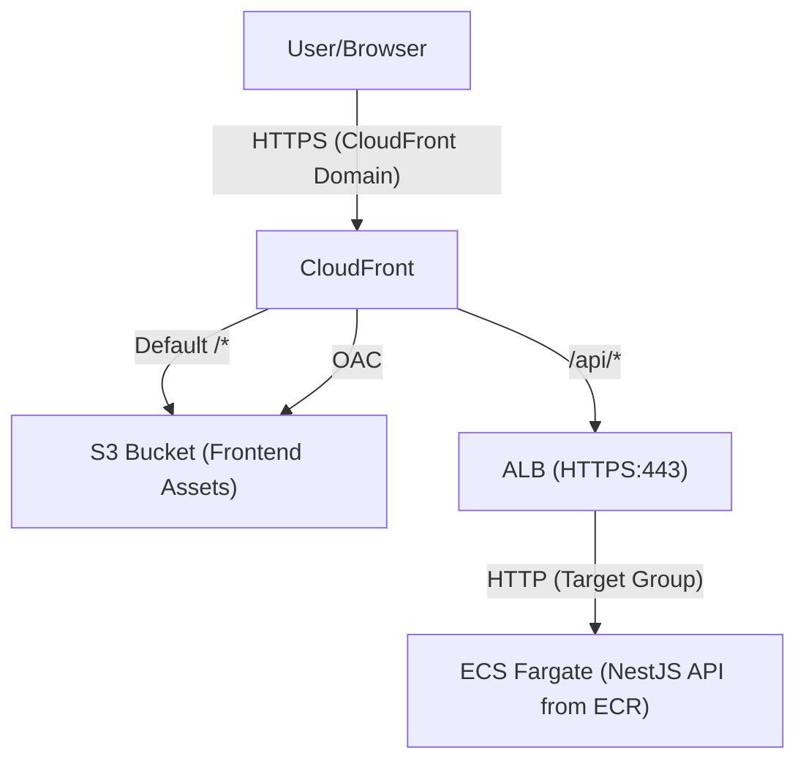
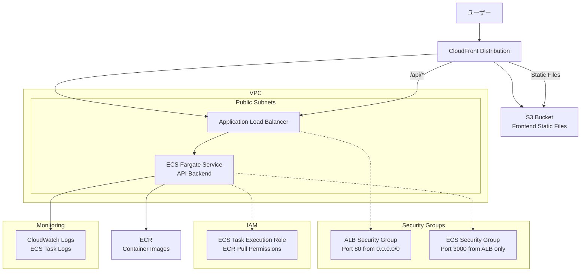

```mermaid

graph TD
%% top down
    User["User/Browser"]
    %% ノード（箱）を1つ作ります
    %% Userは、ノードのID（識別子、内部的な名前）です
		%% ["User/Browser"]は、ノード内に表示されるラベル（見た目の名前）です
    CloudFront["CloudFront"]
    S3["S3 Bucket (Frontend Assets)"]
    ALB["ALB (HTTPS:443)"]
    ECS["ECS Fargate (NestJS API from ECR)"]

    User -- "HTTPS (CloudFront Domain)" --> CloudFront
    CloudFront -- "Default /*" --> S3
    CloudFront -- "OAC" --> S3
    CloudFront -- "/api/*" --> ALB
    ALB -- "HTTP (Target Group)" --> ECS


```

```mermaid

graph TB
    User[ユーザー] --> CF[CloudFront Distribution]
    
    CF --> S3[S3 Bucket<br/>Frontend Static Files]
    CF --> ALB[Application Load Balancer]
    
    ALB --> ECS[ECS Fargate Service<br/>API Backend]
    ECS --> ECR[ECR<br/>Container Images]
    
    subgraph "VPC"
        subgraph "Public Subnets"
            ALB
            ECS
        end
    end
    
    subgraph "Security Groups"
        ALB_SG[ALB Security Group<br/>Port 80 from 0.0.0.0/0]
        ECS_SG[ECS Security Group<br/>Port 3000 from ALB only]
    end
    
    subgraph "IAM"
        ECS_Role[ECS Task Execution Role<br/>ECR Pull Permissions]
    end
    
    subgraph "Monitoring"
        CW[CloudWatch Logs<br/>ECS Task Logs]
    end
    
    ALB -.-> ALB_SG
    ECS -.-> ECS_SG
    ECS -.-> ECS_Role
    ECS --> CW
    
    CF --> |/api/*| ALB
    CF --> |Static Files| S3

```