# ハンニバルのアルプス越えルートアプリケーション

  

  

 

## 🌐 デモサイト

[hamilcar-hannibal.click](https://hamilcar-hannibal.click) でライブデモをご覧いただけます。

コスト効率化のためGitHub Actionsで、Terraform管理しているAWSリソースを一括で自動デストロイ・デプロイしています。  
デモをご覧になりたい場合はお気軽にお声がけください😊

 

## AWS Architecture Diagram

### 手動作成版（Cacoo）

  

### 自動生成版（Python diagrams）

  

## 📋 ドキュメント

- [セットアップガイド](./docs/setup/README.md) - 環境構築・事前準備
- [運用ガイド](./docs/operations/README.md) - IAM管理・監視・分析
- [アーキテクチャ](./docs/architecture/mermaid/README.md) - システム構成図

 

## 🚀 完全自動化デプロイメント

  

- **Infrastructure as Code**: Terraform完全管理
- **GitHub Actions**: ワンクリックデプロイ
- **Blue/Green + Canary**: 無停止デプロイ
- **自動ロールバック**: 失敗時即座復旧

 

## 🔧 技術スタック

### フロントエンド
- React + TypeScript
- GraphQL
- Vite
- Mapbox

### バックエンド
- NestJS
- GraphQL
- PostgreSQL

詳細は[デプロイメントガイド](./docs/deployment/codedeploy-blue-green.md)を参照

## 🔐 セキュリティ

- Permission Boundary
- CloudTrail監査
- **Athena分析**: CloudTrail権限最適化
- AssumeRole権限分離
- CloudWatch監視
- GuardDuty脅威検知