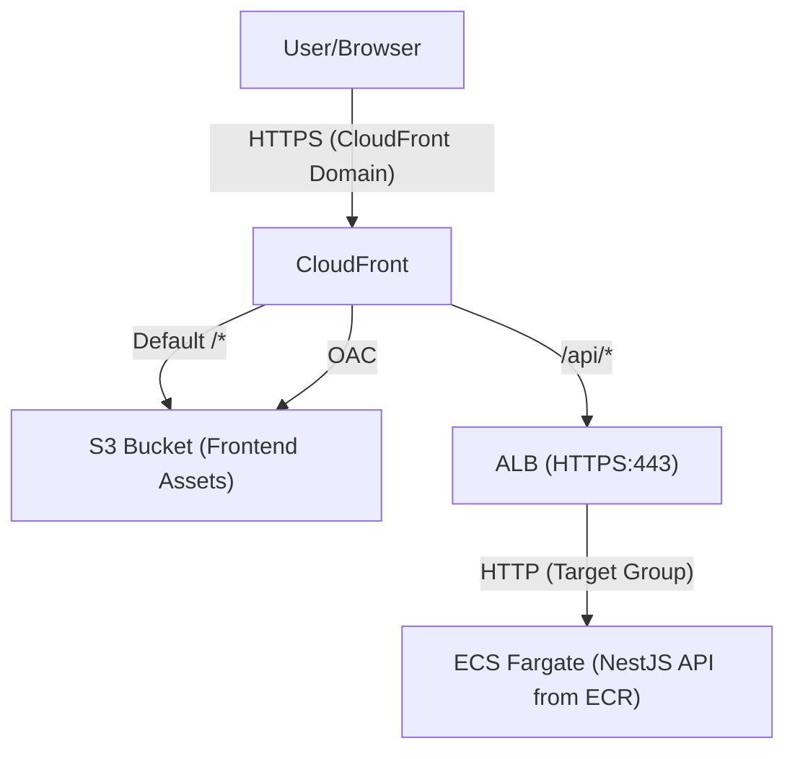
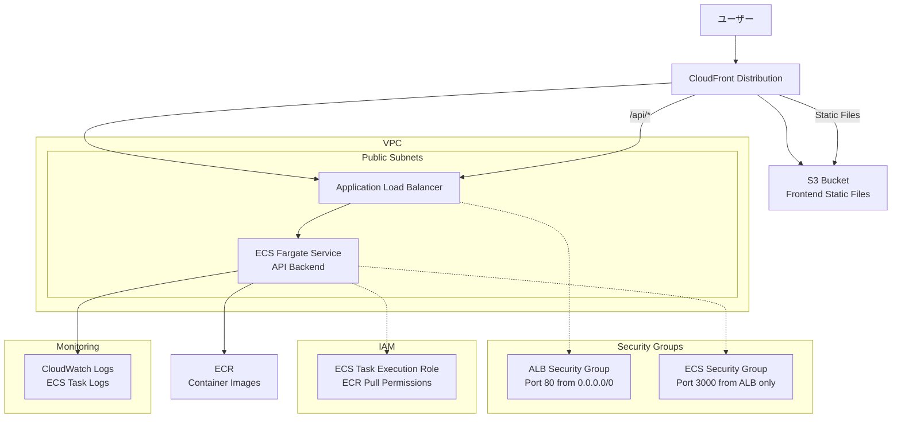

# NestJS Hannibal 3

## 🚀 セットアップ手順

### **⚠️ 重要: ECRリポジトリの事前作成**
GitHub Actionsを実行する前に、ECRリポジトリを手動で作成してください。

```bash
# 一度だけ実行（プロジェクト初期セットアップ時）
aws ecr create-repository --repository-name nestjs-hannibal-3 --region ap-northeast-1

# 作成確認
aws ecr describe-repositories --repository-names nestjs-hannibal-3 --region ap-northeast-1
```

**理由**: CI/CDの安定性向上、権限エラー回避、実行時間短縮

## 🔐 Infrastructure as Code原則

### **ECRライフサイクルポリシー**
- ✅ **Terraformで管理**: インフラの設定をコードで管理
- ✅ **変更履歴追跡**: Gitで変更の追跡が可能
- ✅ **環境再現性**: 同じ設定を他環境で再現可能
- ✅ **チーム共有**: 設定内容をコードとして共有

## 🔐 IAM権限管理の複雑さについて

### **なぜIAM権限管理は難しいのか？**

#### 1. **権限の細分化** - 数千個の権限が存在
```bash
# ECRだけでも20+の権限が存在
ecr:BatchCheckLayerAvailability
ecr:BatchDeleteImage
ecr:BatchGetImage
ecr:CreateRepository
ecr:DeleteLifecyclePolicy
ecr:DeleteRepository
ecr:DescribeImages
ecr:DescribeRepositories
ecr:GetAuthorizationToken
ecr:GetDownloadUrlForLayer
ecr:GetLifecyclePolicy
ecr:InitiateLayerUpload
ecr:ListImages
ecr:ListTagsForResource  # ← これが今回のエラー原因
ecr:PutImage
ecr:PutLifecyclePolicy   # ← これもエラー原因
ecr:TagResource
ecr:UntagResource
ecr:UploadLayerPart
# ...さらに多数
```

#### 2. **IAMユーザーのポリシー上限制限**
- **最大10個のマネージドポリシー**しかアタッチできない
- **インラインポリシーは最大2048文字**まで
- 複数サービス使用時に制限に引っかかりやすい

#### 3. **最小権限の原則 vs 開発効率**
```bash
# ❌ 過剰権限（セキュリティリスク）
"arn:aws:iam::aws:policy/PowerUserAccess"

# ✅ 最小権限（管理が複雑）
ecr:GetAuthorizationToken (ECRログイン)
ecr:BatchCheckLayerAvailability (イメージ確認)
ecr:GetDownloadUrlForLayer (レイヤーダウンロード)
ecr:BatchGetImage (イメージ取得)
ecr:PutImage (イメージプッシュ)
# ...必要な権限のみを個別設定
```

### **現実的な解決策**

#### ✅ **開発環境**: 手動設定 + 最小構成
- ECR: 手動作成 → Terraformで静的参照
- ライフサイクルポリシー: AWS Consoleで手動設定
- **理由**: 権限エラー回避、デプロイ安定性向上

#### ✅ **本番環境**: Infrastructure as Code
- 専用IAMロールで権限分離
- CloudFormation/CDKでの権限管理
- **理由**: セキュリティ強化、監査対応

### **今回の判断理由**
1. **開発効率優先**: 権限調査・設定より機能開発に集中
2. **エラー回避**: CI/CD安定性確保
3. **学習コスト削減**: IAM深堀りより全体理解優先

## 📦 アーキテクチャ




