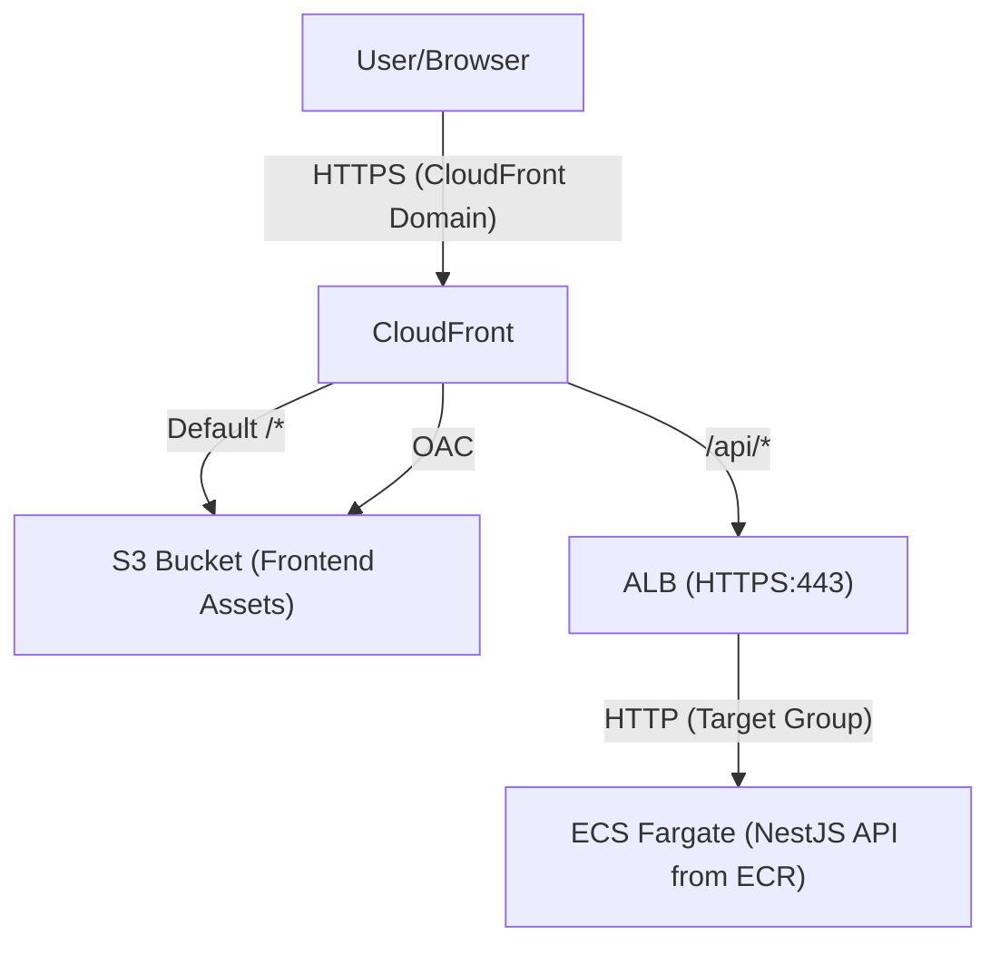
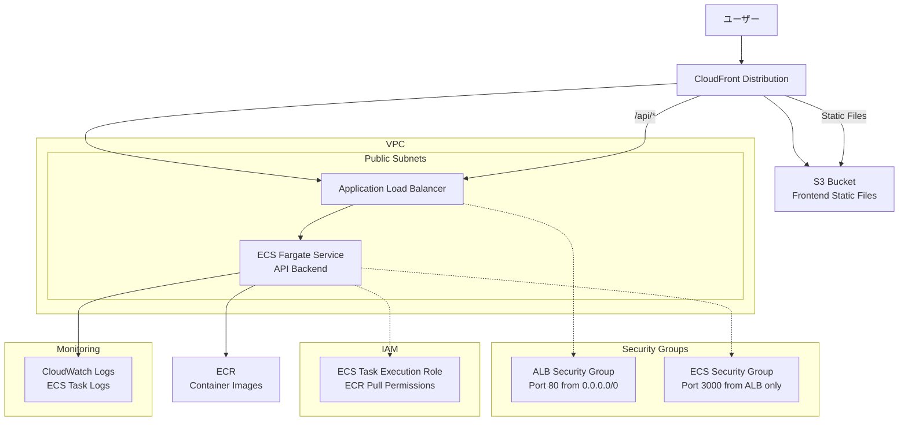

# NestJS Hannibal 3

## 🚀 セットアップ手順

### 🗂️ Terraform stateの永続管理について

このプロジェクトでは、**CloudFrontやS3などのリソース管理情報（stateファイル）をS3バケットで永続管理**しています。

#### **理由**
- CI/CDや複数環境で同じstateを共有し、リソースの重複作成や管理漏れを防ぐため
- CloudFrontディストリビューションなどが「毎回新規作成」される問題を防ぐため

#### **設定方法**
1. S3バケット（例: `nestjs-hannibal-3-terraform-state`）を作成
2. `terraform/frontend/backend.tf`に以下を記述

   ```hcl
   terraform {
     backend "s3" {
       bucket = "nestjs-hannibal-3-terraform-state"
       key    = "frontend/terraform.tfstate"
       region = "ap-northeast-1"
     }
   }
   ```

3. `terraform init`を`terraform/frontend`ディレクトリで実行

#### **注意**
- S3バケットは事前に手動で作成しておく必要があります
- backend設定を変更した場合は、必ず`terraform init`を再実行してください

### **⚠️ 重要: GitHub Actions実行前の準備**

GitHub ActionsのCI/CDパイプラインを安定して実行するため、以下の3つのリソースを事前に手動作成してください。

#### **1. ECRリポジトリの事前作成**
```bash
# コンテナイメージを保存するECRリポジトリを作成
aws ecr create-repository --repository-name nestjs-hannibal-3 --region ap-northeast-1

# 作成確認
aws ecr describe-repositories --repository-names nestjs-hannibal-3 --region ap-northeast-1
```

#### **2. S3バケットの事前作成**
```bash
# フロントエンドの静的ファイルを保存するS3バケットを作成
aws s3 mb s3://nestjs-hannibal-3-frontend --region ap-northeast-1

# 作成確認
aws s3 ls s3://nestjs-hannibal-3-frontend
```

#### **3. CloudFront Origin Access Control (OAC) の事前作成**
```bash
# S3バケットへの安全なアクセスを制御するOACを作成
aws cloudfront create-origin-access-control \
  --name nestjs-hannibal-3-oac \
  --origin-access-control-origin-type s3 \
  --signing-behavior always \
  --signing-protocol sigv4 \
  --region us-east-1

# 作成されたOACのIDを確認
aws cloudfront list-origin-access-controls --region us-east-1
```

**重要**: OACのIDを取得後、`terraform/frontend/main.tf`の47行目を更新してください：
```hcl
data "aws_cloudfront_origin_access_control" "s3_oac" {
  id = "取得したOACのID" # E1EA19Y8SLU52Dを実際のIDに置き換え
}
```

### **🔧 手動作成リソース一覧（CI/CD用・Terraform参照）**
| リソース | 名前 | 目的 | 作成方法 | 管理方法 |
|---------|------|------|----------|----------|
| ECRリポジトリ | `nestjs-hannibal-3` | コンテナイメージ保存 | AWS CLI | **手動管理（Terraform参照）** |
| S3バケット | `nestjs-hannibal-3-frontend` | フロントエンド静的ファイル | AWS CLI | **手動管理（Terraform参照）** |
| CloudFront OAC | `nestjs-hannibal-3-oac` | S3バケットへの安全なアクセス | AWS CLI | **手動管理（Terraform参照）** |

**手動作成の理由**: 
- ✅ **権限エラー回避**: GitHub Actions実行時の権限不足エラーを防ぐ
- ✅ **CI/CD安定性**: デプロイパイプラインの安定性向上
- ✅ **実行時間短縮**: リソース作成時間を短縮
- 📝 **注意**: リソース本体は手動管理、Terraformはdataリソースで参照のみ

### **🔒 永続保持リソース（監査・基盤用・Terraform管理外）**
以下のリソースは**destroy時も削除されず、永続的に保持**されます：

| リソース | 名前 | 目的 | 理由 | 管理方法 |
|---------|------|------|------|----------|
| S3バケット | `nestjs-hannibal-3-terraform-state` | Terraform状態ファイル | 基盤リソース | **手動管理** |
| S3バケット | `nestjs-hannibal-3-cloudtrail-logs` | CloudTrail監査ログ | セキュリティ監査 | **手動管理** |

**永続保持の理由**:
- 🔒 **セキュリティ監査**: API呼び出しの証跡保存
- 📊 **権限分析**: 将来の最小権限最適化
- 💰 **コスト最適化**: ストレージ料金は数セント程度
- 📝 **注意**: Terraform管理外のため、destroy時も自動削除されません

### ✅ IAM権限設定（完了済み）

このプロジェクトのIAM権限設定は完了しています。

#### 設定済みリソース
- **HannibalCICDRole-Dev**: CI/CD用IAMロール
- **HannibalCICDPolicy-Dev**: CI/CD用ポリシー（最新版）
- **GitHub Secrets**: AWS認証情報設定済み

> ※ 初回セットアップ時に一時的な高権限が必要でしたが、現在は完了しているため追加作業は不要です。

## ⚠️ インフラ削除（destroy）時の注意

> **補足:** CloudFrontディストリビューションは、循環参照や削除遅延の問題から「手動削除＋tfstateからstate rm」が現場のベストプラクティスです。Terraform destroyによる一括削除はエラーや不整合が起きやすいため、下記の手順を推奨します。

Terraform destroy（destroy.yml）を実行する前に、**必ずAWSマネジメントコンソールでCloudFrontディストリビューションを手動で「Disable→Delete」してください**。

さらに、**tfstate（S3）からCloudFrontリソースを削除する必要があります**。

### 手順
1. AWSマネジメントコンソールにログインし、CloudFrontサービスを開く
2. 対象のCloudFrontディストリビューションを選択
3. 「Disable（無効化）」を実行し、ステータスがDisabledになるのを待つ
4. 「Delete（削除）」を実行し、完全に削除されるのを確認
5. `terraform/frontend`ディレクトリで以下を実行し、tfstateからCloudFrontリソースを削除
   ```bash
   cd C:\code\javascript\nestjs-hannibal-3\terraform\frontend

   terraform state rm aws_cloudfront_distribution.main
   ```
   ※「リソース名」はmain.tfで定義したものに置き換えてください
6. **CloudFrontリソースがtfstateから削除されたことを確認**
   ```bash
   terraform state list
   ```
   何も表示されなければOKです。
7. その後、GitHub Actionsのdestroy.ymlを実行

> これを忘れると、循環参照エラーや「origin.0.domain_name must not be empty」などのエラーが発生します。

### 🛠️ 既存リソースがある場合の対応（terraform import）

AWS上にすでに同名のリソース（例：セキュリティグループ）が存在していて
`InvalidGroup.Duplicate` などのエラーが出る場合は、**terraform import**コマンドで既存リソースをTerraform管理下に取り込んでください。

#### 例：セキュリティグループのインポート

1. AWSコンソールやCLIで既存リソースのIDを調べる
   ```sh
   aws ec2 describe-security-groups --filters Name=group-name,Values=nestjs-hannibal-3-alb-sg Name=vpc-id,Values=<VPC_ID> --query 'SecurityGroups[0].GroupId' --output text
   ```

2. terraform importコマンドでインポート
   ```sh
   cd terraform/backend
   terraform import aws_security_group.alb_sg <セキュリティグループID>
   ```

3. その後、terraform plan/applyを実行

> これにより、既存リソースを削除せずにTerraformで一元管理できるようになります。

## 🔐 Infrastructure as Code原則

### **ECRライフサイクルポリシー**
- ✅ **Terraformで管理**: インフラの設定をコードで管理
- ✅ **変更履歴追跡**: Gitで変更の追跡が可能
- ✅ **環境再現性**: 同じ設定を他環境で再現可能
- ✅ **チーム共有**: 設定内容をコードとして共有


## 🔐 IAM構成 (AWS Professional設計)

### **基盤IAMリソース**
```
👤 hannibal (IAMユーザー・メイン開発者)
├── インラインポリシー: AssumeDevRole
└── 使用可能ロール: HannibalDeveloperRole-Dev
   └── アタッチポリシー: HannibalDeveloperPolicy-Dev（ECR/ECS/RDS/CloudWatch/EC2/ELB/S3/CloudFront/IAM）

🤖 hannibal-cicd (IAMユーザー・CI/CD自動化)
├── インラインポリシー: AssumeCICDRole
└── 使用可能ロール: HannibalCICDRole-Dev
   ├── Permission Boundary: HannibalCICDBoundary
   ├── アタッチポリシー: HannibalCICDPolicy-Dev-Minimal（CloudTrail分析に基づく最小権限）
   └── 保持ポリシー: HannibalCICDPolicy-Dev（広い権限・未アタッチ）
```

### **アプリケーションIAMリソース（一時的・Terraform管理）**
```
🔧 ecs-tasks.amazonaws.com (ECSサービス)
└── 使用ロール: nestjs-hannibal-3-ecs-task-execution-role（Terraform管理）
   ├── Permission Boundary: HannibalECSBoundary（現在永続化・検討の余地あり）
   └── アタッチポリシー: AmazonECSTaskExecutionRolePolicy（AWS管理ポリシー・Terraformでアタッチ）
```

### **運用フロー**
```bash
# 日常開発 (hannibal)
aws sts assume-role --role-arn arn:aws:iam::258632448142:role/HannibalDeveloperRole-Dev --role-session-name dev-session

# 自動デプロイ (GitHub Actions)
# hannibal-cicdの認証情報でHannibalCICDRole-DevをAssume
```

### **管理方針**
- **IAMユーザー**: 完全手動管理
- **IAMロール・ポリシー**: Terraform作成後、管理から除外・永続保持
- **段階的権限縮小**: CloudTrailログ分析後に最小権限化完了

## 📦 アーキテクチャ





