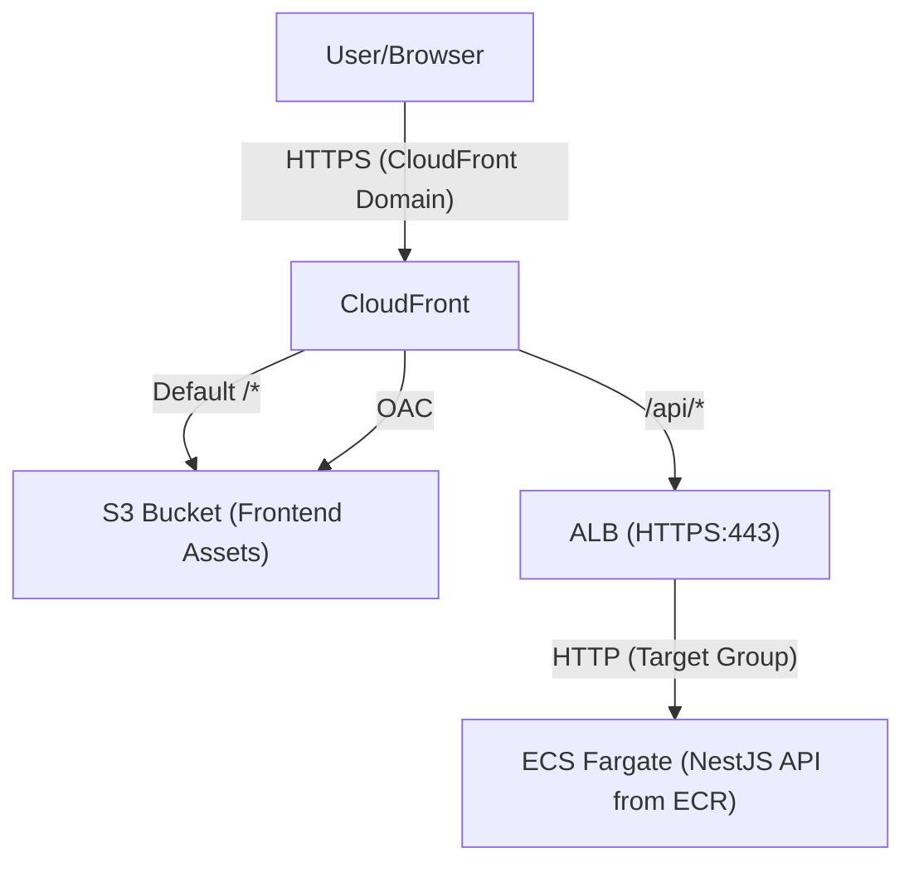
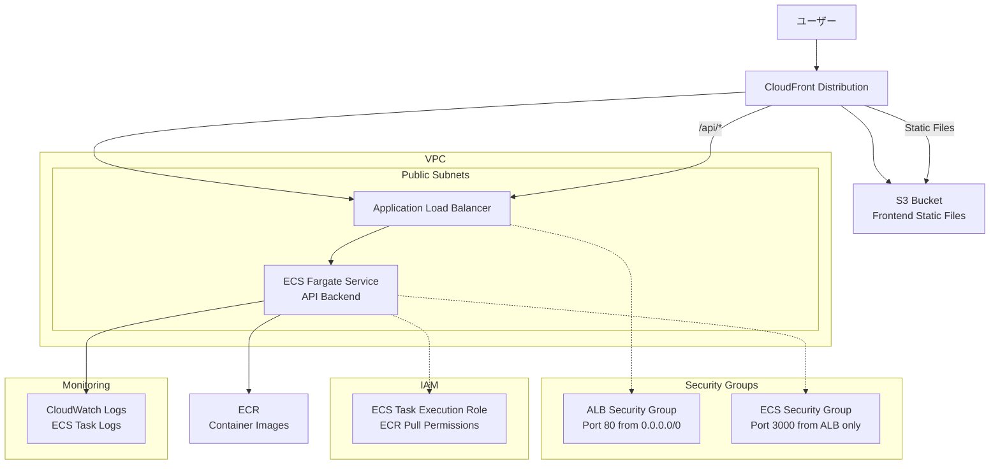

# NestJS Hannibal 3

## 🚀 セットアップ手順

### 🗂️ Terraform stateの永続管理について

このプロジェクトでは、**CloudFrontやS3などのリソース管理情報（stateファイル）をS3バケットで永続管理**しています。

#### **理由**
- CI/CDや複数環境で同じstateを共有し、リソースの重複作成や管理漏れを防ぐため
- CloudFrontディストリビューションなどが「毎回新規作成」される問題を防ぐため

#### **設定方法**
1. S3バケット（例: `nestjs-hannibal-3-terraform-state`）を作成
2. `terraform/frontend/backend.tf`に以下を記述

   ```hcl
   terraform {
     backend "s3" {
       bucket = "nestjs-hannibal-3-terraform-state"
       key    = "frontend/terraform.tfstate"
       region = "ap-northeast-1"
     }
   }
   ```

3. `terraform init`を`terraform/frontend`ディレクトリで実行

#### **注意**
- S3バケットは事前に手動で作成しておく必要があります
- backend設定を変更した場合は、必ず`terraform init`を再実行してください

### **⚠️ 重要: GitHub Actions実行前の準備**

GitHub ActionsのCI/CDパイプラインを安定して実行するため、以下のリソースを事前に手動作成してください。

#### **1. ECRリポジトリの事前作成**
```bash
# コンテナイメージを保存するECRリポジトリを作成
aws ecr create-repository --repository-name nestjs-hannibal-3 --region ap-northeast-1

# 作成確認
aws ecr describe-repositories --repository-names nestjs-hannibal-3 --region ap-northeast-1
```

#### **2. S3バケットの事前作成**
```bash
# フロントエンドの静的ファイルを保存するS3バケットを作成
aws s3 mb s3://nestjs-hannibal-3-frontend --region ap-northeast-1

# 作成確認
aws s3 ls s3://nestjs-hannibal-3-frontend
```

#### **3. CloudFront Origin Access Control (OAC) の事前作成**
```bash
# S3バケットへの安全なアクセスを制御するOACを作成
aws cloudfront create-origin-access-control \
  --name nestjs-hannibal-3-oac \
  --origin-access-control-origin-type s3 \
  --signing-behavior always \
  --signing-protocol sigv4 \
  --region us-east-1

# 作成されたOACのIDを確認
aws cloudfront list-origin-access-controls --region us-east-1
```

**重要**: OACのIDを取得後、`terraform/frontend/main.tf`の47行目を更新してください：
```hcl
data "aws_cloudfront_origin_access_control" "s3_oac" {
  id = "取得したOACのID" # E1EA19Y8SLU52Dを実際のIDに置き換え
}
```

#### **4. IAMカスタムポリシーの事前適用**
GitHub Actionsで権限エラーを防ぐため、hannibalユーザーに必要な権限を事前に適用します。

```bash
# ディレクトリ移動
cd C:\code\javascript\nestjs-hannibal-3\terraform\backend

# Terraform初期化
terraform init

# IAMFullAccess一時付与（AWS Console or CLI）
aws iam attach-user-policy --user-name hannibal --policy-arn arn:aws:iam::aws:policy/IAMFullAccess

# カスタムポリシー作成・アタッチ（PowerShellは引用符必須）
terraform apply -target="aws_iam_policy.hannibal_terraform_policy" -target="aws_iam_user_policy_attachment.hannibal_terraform_policy" -auto-approve

# IAMFullAccessデタッチ（セキュリティ強化）
aws iam detach-user-policy --user-name hannibal --policy-arn arn:aws:iam::aws:policy/IAMFullAccess
```

### **📋 手動作成リソース一覧**
| リソース | 名前 | 目的 | 作成方法 |
|---------|------|------|----------|
| ECRリポジトリ | `nestjs-hannibal-3` | コンテナイメージ保存 | AWS CLI |
| S3バケット | `nestjs-hannibal-3-frontend` | フロントエンド静的ファイル | AWS CLI |
| CloudFront OAC | `nestjs-hannibal-3-oac` | S3バケットへの安全なアクセス | AWS CLI |

**手動作成の理由**: 
- ✅ **権限エラー回避**: GitHub Actions実行時の権限不足エラーを防ぐ
- ✅ **CI/CD安定性**: デプロイパイプラインの安定性向上
- ✅ **実行時間短縮**: リソース作成時間を短縮

### **🔄 実行順序**
AWSから全削除した後にGitHub Actionsを動かす場合、以下の順序で実行してください：

1. **ECRリポジトリ作成**
   ```bash
   aws ecr create-repository --repository-name nestjs-hannibal-3 --region ap-northeast-1
   ```

2. **S3バケット作成**
   ```bash
   aws s3 mb s3://nestjs-hannibal-3-frontend --region ap-northeast-1
   ```

3. **CloudFront OAC作成**
   ```bash
   aws cloudfront create-origin-access-control \
     --name nestjs-hannibal-3-oac \
     --origin-access-control-origin-type s3 \
     --signing-behavior always \
     --signing-protocol sigv4 \
     --region us-east-1
   ```

4. **OACのIDをTerraform設定に反映**
   ```bash
   # OACのIDを確認
   aws cloudfront list-origin-access-controls --region us-east-1
   ```
   取得したIDを`terraform/frontend/main.tf`の47行目に設定

5. **IAMカスタムポリシー適用**
   ```bash
   cd terraform/backend
   terraform init
   terraform apply -target="aws_iam_policy.hannibal_terraform_policy" -target="aws_iam_user_policy_attachment.hannibal_terraform_policy" -auto-approve
   ```

6. **GitHub Actions実行**
   - ブランチにプッシュしてGitHub Actionsを開始

### **作成されるカスタムポリシー詳細**
- **ポリシー名**: `HannibalInfraAdminPolicy`
- **対象サービス**: ECR, CloudWatch, ELB, EC2, ECS, IAM, S3, CloudFront
- **GitHub Actions対応**: リソース削除・作成権限を含む
- **10個制限対応**: 8つのサービス権限を1つのポリシーに統合

## 🔐 Infrastructure as Code原則

### **ECRライフサイクルポリシー**
- ✅ **Terraformで管理**: インフラの設定をコードで管理
- ✅ **変更履歴追跡**: Gitで変更の追跡が可能
- ✅ **環境再現性**: 同じ設定を他環境で再現可能
- ✅ **チーム共有**: 設定内容をコードとして共有

## 🔐 IAM権限管理の複雑さについて

### **IAM権限管理が難しい理由**

#### 1. **権限の細分化**
AWSには数千個の権限が存在し、ECRだけでも20以上の権限があります：
```bash
# ECRの主要権限例
ecr:BatchCheckLayerAvailability
ecr:BatchDeleteImage
ecr:BatchGetImage
ecr:CreateRepository
ecr:DeleteLifecyclePolicy
ecr:DeleteRepository
ecr:DescribeImages
ecr:DescribeRepositories
ecr:GetAuthorizationToken
ecr:GetDownloadUrlForLayer
ecr:GetLifecyclePolicy
ecr:InitiateLayerUpload
ecr:ListImages
ecr:ListTagsForResource
ecr:PutImage
ecr:PutLifecyclePolicy
ecr:TagResource
ecr:UntagResource
ecr:UploadLayerPart
```

#### 2. **IAMユーザーのポリシー上限制限**
- **最大10個のマネージドポリシー**しかアタッチできない
- **インラインポリシーは最大2048文字**まで
- 複数サービス使用時に制限に引っかかりやすい

#### 3. **最小権限の原則 vs 開発効率**
```bash
# ❌ 過剰権限（セキュリティリスク）
"arn:aws:iam::aws:policy/PowerUserAccess"

# ✅ 最小権限（管理が複雑）
ecr:GetAuthorizationToken (ECRログイン)
ecr:BatchCheckLayerAvailability (イメージ確認)
ecr:GetDownloadUrlForLayer (レイヤーダウンロード)
ecr:BatchGetImage (イメージ取得)
ecr:PutImage (イメージプッシュ)
```

### **現実的な解決策**

#### ✅ **開発環境**: 手動設定 + 最小構成
- ECR: 手動作成 → Terraformで静的参照
- ライフサイクルポリシー: AWS Consoleで手動設定
- **理由**: 権限エラー回避、デプロイ安定性向上

#### ✅ **本番環境**: Infrastructure as Code
- 専用IAMロールで権限分離
- CloudFormation/CDKでの権限管理
- **理由**: セキュリティ強化、監査対応

### **今回の判断理由**
1. **開発効率優先**: 権限調査・設定より機能開発に集中
2. **エラー回避**: CI/CD安定性確保
3. **学習コスト削減**: IAM深堀りより全体理解優先

## 📦 アーキテクチャ





