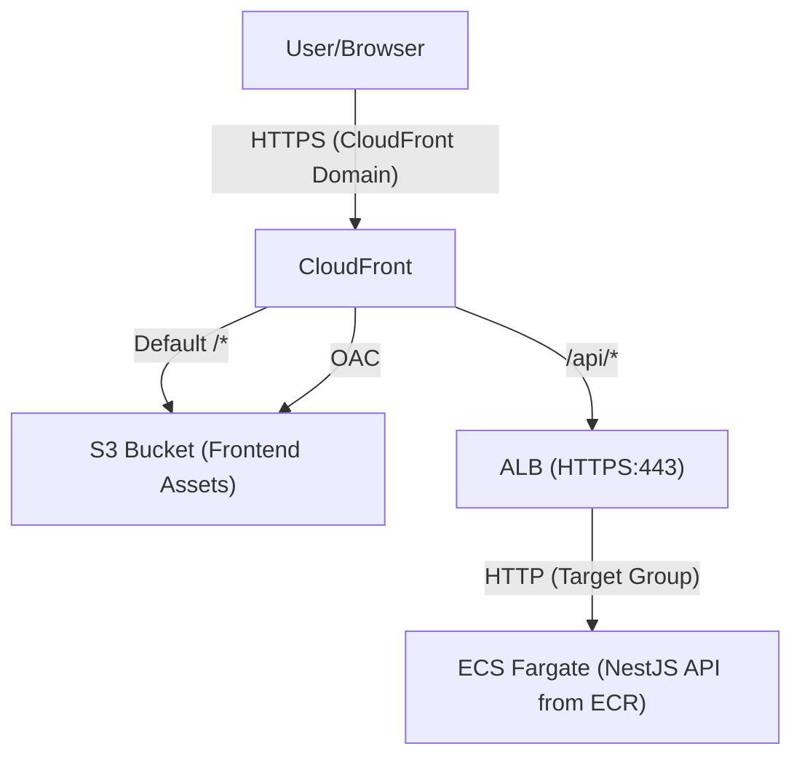

```mermaid

graph TD
%% top down
    User["User/Browser"]
    %% ノード（箱）を1つ作ります
    %% Userは、ノードのID（識別子、内部的な名前）です
		%% ["User/Browser"]は、ノード内に表示されるラベル（見た目の名前）です
    CloudFront["CloudFront"]
    S3["S3 Bucket (Frontend Assets)"]
    ALB["ALB (HTTPS:443)"]
    ECS["ECS Fargate (NestJS API from ECR)"]

    User -- "HTTPS (CloudFront Domain)" --> CloudFront
    CloudFront -- "Default /*" --> S3
    CloudFront -- "OAC" --> S3
    CloudFront -- "/api/*" --> ALB
    ALB -- "HTTP (Target Group)" --> ECS


```