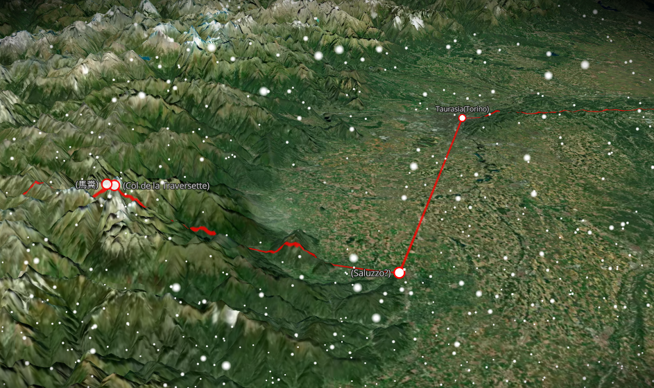

# ハンニバルのアルプス越えルートアプリケーション

<div align="center">
  


</div>

<div align="center">
  
</div>

<div align="center">
  
</div>

<br>

## 💡 プロジェクト概要

歴史的ルートを可視化するWebアプリケーションを題材に、**実務で使われるAWSサービス構成で構築**。

<br>

## 🌐 デモサイト

[hamilcar-hannibal.click](https://hamilcar-hannibal.click) でライブデモをご覧いただけます。

**現在停止中** - コスト効率化のため、現在はAWSリソースを停止しています。  
GitHub Actionsでワンクリック**デプロイ・デストロイ**が可能です。
デモご希望の際はお声がけください😊

<br>

## AWS Architecture Diagram

<div align="center">
  
</div>

<br>

## 🏗️ Infrastructure as Code

### Terraform 構成
```
terraform/
├── foundation/          # 基盤リソース
│   ├── iam.tf          # Permission Boundary + AssumeRole
│   ├── athena.tf       # CloudTrail分析
│   ├── billing.tf      # コスト監視
│   └── guardduty.tf    # 脅威検知（コスト削減のため無効化中）
├── environments/dev/    # 環境別設定
│   └── main.tf         # モジュール統合
└── modules/            # 再利用可能なモジュール
    ├── cdn/            # CloudFront
    ├── cicd/           # CodeDeploy Blue/Green
    ├── compute/        # ECS Fargate + ALB
    ├── networking/     # 3層VPC（Public/App/Data）+ Route53
    ├── observability/  # CloudWatch監視
    ├── security/       # Security Groups + IAM
    └── storage/        # RDS + S3
```

**State管理**: S3 + DynamoDB（Terraform State Lock）

<br>

## 🤖 GitHub Actions ワークフロー

### デプロイ（deploy.yml）
モード選択可能：
- **provisioning**: 初回構築（Blue環境のみ）
- **bluegreen**: 0% → 100%（一括切替）
- **canary**: 10% → 100%（5分間隔）

### デストロイ（destroy.yml）
- ワンクリックでAWSリソース削除

### プルリクエスト自動チェック（pr-check.yml）
- Backend: ESLint + Build
- Frontend: TypeScript + Build
- Terraform: Format + Validate

### アーキテクチャ図自動生成（architecture-diagram.yml）
- Python diagramsで構成図を自動更新

<br>

### デプロイ実行例（provisioningモード）

<div align="center">
  
</div>

<br>

## 🔧 技術スタック

### フロントエンド
- React + TypeScript
- GraphQL
- Vite
- Mapbox

### バックエンド
- NestJS
- GraphQL
- PostgreSQL

詳細は[デプロイメントガイド](./docs/deployment/codedeploy-blue-green.md)を参照

## 📋 ドキュメント

- [セットアップガイド](./docs/setup/README.md) - 環境構築・事前準備
- [運用ガイド](./docs/operations/README.md) - IAM管理・監視・分析
- [アーキテクチャ](./docs/architecture/aws/mermaid/README.md) - システム構成図

