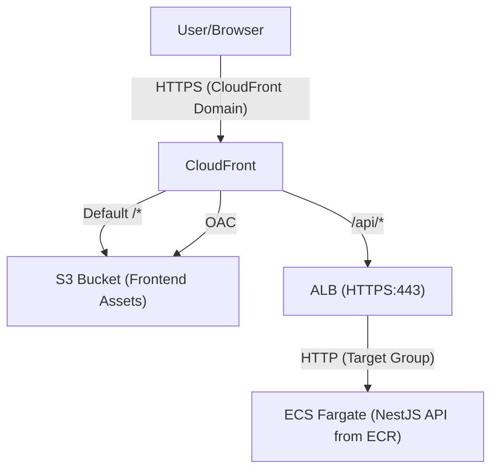
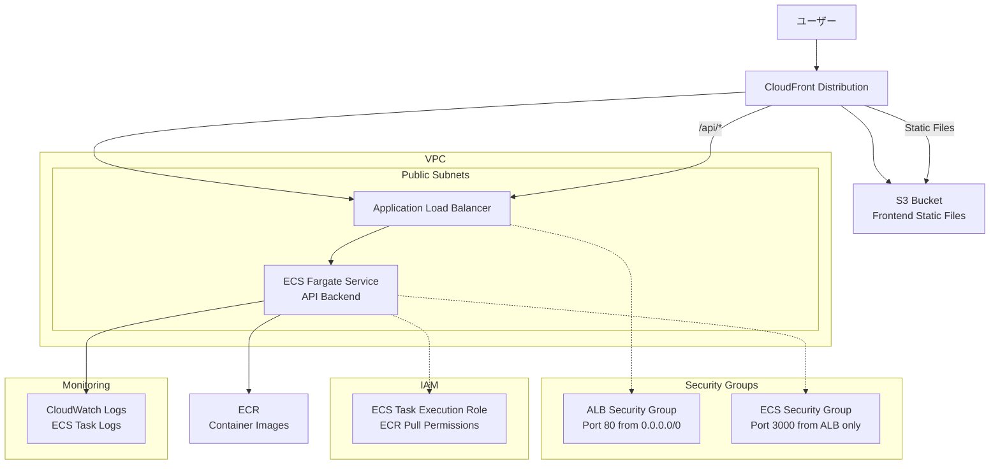

# NestJS Hannibal 3

## 🚀 セットアップ手順

### 🗂️ Terraform stateの永続管理について

このプロジェクトでは、**CloudFrontやS3などのリソース管理情報（stateファイル）をS3バケットで永続管理**しています。

#### **理由**
- CI/CDや複数環境で同じstateを共有し、リソースの重複作成や管理漏れを防ぐため
- CloudFrontディストリビューションなどが「毎回新規作成」される問題を防ぐため

#### **設定方法**
1. S3バケット（例: `nestjs-hannibal-3-terraform-state`）を作成
2. `terraform/frontend/backend.tf`に以下を記述

   ```hcl
   terraform {
     backend "s3" {
       bucket = "nestjs-hannibal-3-terraform-state"
       key    = "frontend/terraform.tfstate"
       region = "ap-northeast-1"
     }
   }
   ```

3. `terraform init`を`terraform/frontend`ディレクトリで実行

#### **注意**
- S3バケットは事前に手動で作成しておく必要があります
- backend設定を変更した場合は、必ず`terraform init`を再実行してください

### **⚠️ 重要: GitHub Actions実行前の準備**

GitHub ActionsのCI/CDパイプラインを安定して実行するため、以下の3つのリソースを事前に手動作成してください。

#### **1. ECRリポジトリの事前作成**
```bash
# コンテナイメージを保存するECRリポジトリを作成
aws ecr create-repository --repository-name nestjs-hannibal-3 --region ap-northeast-1

# 作成確認
aws ecr describe-repositories --repository-names nestjs-hannibal-3 --region ap-northeast-1
```

#### **2. S3バケットの事前作成**
```bash
# フロントエンドの静的ファイルを保存するS3バケットを作成
aws s3 mb s3://nestjs-hannibal-3-frontend --region ap-northeast-1

# 作成確認
aws s3 ls s3://nestjs-hannibal-3-frontend
```

#### **3. CloudFront Origin Access Control (OAC) の事前作成**
```bash
# S3バケットへの安全なアクセスを制御するOACを作成
aws cloudfront create-origin-access-control \
  --name nestjs-hannibal-3-oac \
  --origin-access-control-origin-type s3 \
  --signing-behavior always \
  --signing-protocol sigv4 \
  --region us-east-1

# 作成されたOACのIDを確認
aws cloudfront list-origin-access-controls --region us-east-1
```

**重要**: OACのIDを取得後、`terraform/frontend/main.tf`の47行目を更新してください：
```hcl
data "aws_cloudfront_origin_access_control" "s3_oac" {
  id = "取得したOACのID" # E1EA19Y8SLU52Dを実際のIDに置き換え
}
```

### **🔧 手動作成リソース一覧（CI/CD用・Terraform参照）**
| リソース | 名前 | 目的 | 作成方法 | 管理方法 |
|---------|------|------|----------|----------|
| ECRリポジトリ | `nestjs-hannibal-3` | コンテナイメージ保存 | AWS CLI | **手動管理（Terraform参照）** |
| S3バケット | `nestjs-hannibal-3-frontend` | フロントエンド静的ファイル | AWS CLI | **手動管理（Terraform参照）** |
| CloudFront OAC | `nestjs-hannibal-3-oac` | S3バケットへの安全なアクセス | AWS CLI | **手動管理（Terraform参照）** |

**手動作成の理由**: 
- ✅ **権限エラー回避**: GitHub Actions実行時の権限不足エラーを防ぐ
- ✅ **CI/CD安定性**: デプロイパイプラインの安定性向上
- ✅ **実行時間短縮**: リソース作成時間を短縮
- 📝 **注意**: リソース本体は手動管理、Terraformはdataリソースで参照のみ

### **🔒 永続保持リソース（監査・基盤用・Terraform管理外）**
以下のリソースは**destroy時も削除されず、永続的に保持**されます：

| リソース | 名前 | 目的 | 理由 | 管理方法 |
|---------|------|------|------|----------|
| S3バケット | `nestjs-hannibal-3-terraform-state` | Terraform状態ファイル | 基盤リソース | **手動管理** |
| S3バケット | `nestjs-hannibal-3-cloudtrail-logs` | CloudTrail監査ログ | セキュリティ監査 | **手動管理** |
| S3バケット | `nestjs-hannibal-3-athena-results` | Athena分析結果 | 権限分析基盤 | **手動管理** |
| Athenaテーブル | `cloudtrail_logs_partitioned` | CloudTrail分析 | 権限最適化 | **Terraform管理** |
| Athenaワークグループ | `hannibal-cloudtrail-analysis` | 専用分析環境 | Professional設計 | **Terraform管理** |
| Athenaデータベース | `hannibal_cloudtrail_db` | 論理データ分離 | Professional設計 | **Terraform管理** |

**永続保持の理由**:
- 🔒 **セキュリティ監査**: API呼び出しの証跡保存
- 📊 **権限分析**: 将来の最小権限最適化
- 💰 **コスト最適化**: ストレージ料金は数セント程度
- 📝 **注意**: Terraform管理外のため、destroy時も自動削除されません

### ✅ IAM権限設定（完了済み）

このプロジェクトのIAM権限設定は完了しています。

#### 設定済みリソース
- **HannibalCICDRole-Dev**: CI/CD用IAMロール
- **HannibalCICDPolicy-Dev**: CI/CD用ポリシー（最新版）
- **GitHub Secrets**: AWS認証情報設定済み

> ※ 初回セットアップ時に一時的な高権限が必要でしたが、現在は完了しているため追加作業は不要です。


### 🛠️ 既存リソースがある場合の対応（terraform import）

AWS上にすでに同名のリソース（例：セキュリティグループ）が存在していて
`InvalidGroup.Duplicate` などのエラーが出る場合は、**terraform import**コマンドで既存リソースをTerraform管理下に取り込んでください。

#### 例：セキュリティグループのインポート

1. AWSコンソールやCLIで既存リソースのIDを調べる
   ```sh
   aws ec2 describe-security-groups --filters Name=group-name,Values=nestjs-hannibal-3-alb-sg Name=vpc-id,Values=<VPC_ID> --query 'SecurityGroups[0].GroupId' --output text
   ```

2. terraform importコマンドでインポート
   ```sh
   cd terraform/backend
   terraform import aws_security_group.alb_sg <セキュリティグループID>
   ```

3. その後、terraform plan/applyを実行

> これにより、既存リソースを削除せずにTerraformで一元管理できるようになります。

## 🔐 Infrastructure as Code原則

### **ECRライフサイクルポリシー**
- ✅ **Terraformで管理**: インフラの設定をコードで管理
- ✅ **変更履歴追跡**: Gitで変更の追跡が可能
- ✅ **環境再現性**: 同じ設定を他環境で再現可能
- ✅ **チーム共有**: 設定内容をコードとして共有


## 🔐 IAM構成 (AWS Professional設計)

### **基盤IAMリソース**
```
👤 hannibal (IAMユーザー・メイン開発者)
├── インラインポリシー: AssumeDevRole
└── 使用可能ロール: HannibalDeveloperRole-Dev
   └── アタッチポリシー: HannibalDeveloperPolicy-Dev（ECR/ECS/RDS/CloudWatch/EC2/ELB/S3/CloudFront/IAM）

🤖 hannibal-cicd (IAMユーザー・CI/CD自動化)
├── インラインポリシー: AssumeCICDRole
└── 使用可能ロール: HannibalCICDRole-Dev
   ├── Permission Boundary: HannibalCICDBoundary
   ├── アタッチポリシー: HannibalCICDPolicy-Dev-Minimal（CloudTrail分析に基づく最小権限）
   └── 保持ポリシー: HannibalCICDPolicy-Dev（広い権限・未アタッチ）
```

### **アプリケーションIAMリソース（一時的・Terraform管理）**
```
🔧 ecs-tasks.amazonaws.com (ECSサービス)
└── 使用ロール: nestjs-hannibal-3-ecs-task-execution-role（Terraform管理）
   ├── Permission Boundary: HannibalECSBoundary（現在永続化・検討の余地あり）
   └── アタッチポリシー: AmazonECSTaskExecutionRolePolicy（AWS管理ポリシー・Terraformでアタッチ）
```

### **運用フロー**
```bash
# 日常開発 (hannibal)
aws sts assume-role --role-arn arn:aws:iam::258632448142:role/HannibalDeveloperRole-Dev --role-session-name dev-session

# 自動デプロイ (GitHub Actions)
# hannibal-cicdの認証情報でHannibalCICDRole-DevをAssume
```

### **管理方針**
- **IAMユーザー**: 完全手動管理
- **IAMロール・ポリシー**: Terraform作成後、管理から除外・永続保持
- **段階的権限縮小**: CloudTrailログ分析後に最小権限化完了

## 🔍 権限分析（Athena）

CloudTrailログからCI/CD権限の実際の使用状況を分析し、最小権限の原則に基づいた権限最適化を実施します。

### **分析結果**
- **現在のポリシー**: 160ちょいの権限
- **実際に使用**: **76個の権限**（2025年7月27日15-20時JST分析）
- **削減可能**: 約52%の権限削減が可能

### **企業レベル分析手順**
```bash
# 1. パーティション対応テーブル作成（Named Query使用）
aws athena start-query-execution \
  --query-string "CREATE EXTERNAL TABLE IF NOT EXISTS hannibal_cloudtrail_db.cloudtrail_logs_partitioned (Records array<struct<eventName:string,eventSource:string,userIdentity:struct<arn:string,type:string>,eventTime:string,errorCode:string,errorMessage:string,sourceIPAddress:string,userAgent:string>>) PARTITIONED BY (year string, month string, day string) ROW FORMAT SERDE 'org.apache.hive.hcatalog.data.JsonSerDe' STORED AS INPUTFORMAT 'org.apache.hadoop.mapred.TextInputFormat' OUTPUTFORMAT 'org.apache.hadoop.hive.ql.io.HiveIgnoreKeyTextOutputFormat' LOCATION 's3://nestjs-hannibal-3-cloudtrail-logs/AWSLogs/258632448142/CloudTrail/ap-northeast-1/' TBLPROPERTIES ('projection.enabled'='true', 'projection.year.type'='integer', 'projection.year.range'='2025,2030', 'projection.month.type'='integer', 'projection.month.range'='01,12', 'projection.day.type'='integer', 'projection.day.range'='01,31', 'storage.location.template'='s3://nestjs-hannibal-3-cloudtrail-logs/AWSLogs/258632448142/CloudTrail/ap-northeast-1/\${year}/\${month}/\${day}/', 'has_encrypted_data'='false')" \
  --result-configuration OutputLocation=s3://nestjs-hannibal-3-athena-results/ \
  --work-group hannibal-cloudtrail-analysis

# 2. 企業レベル権限統計分析
aws athena start-query-execution \
  --query-string "SELECT COUNT(DISTINCT CONCAT(regexp_replace(record.eventSource, '\.amazonaws\.com$', ''), ':', record.eventName)) as total_permissions, COUNT(*) as total_api_calls, COUNT(DISTINCT record.eventSource) as services_used, MIN(record.eventTime) as analysis_start, MAX(record.eventTime) as analysis_end FROM hannibal_cloudtrail_db.cloudtrail_logs_partitioned CROSS JOIN UNNEST(Records) AS t(record) WHERE record.userIdentity.arn LIKE '%HannibalCICDRole-Dev%' AND record.errorCode IS NULL AND year = '2025' AND month = '07' AND day >= '27'" \
  --result-configuration OutputLocation=s3://nestjs-hannibal-3-athena-results/ \
  --work-group hannibal-cloudtrail-analysis

# 3. 詳細権限分析（時系列対応）
aws athena start-query-execution \
  --query-string "SELECT CONCAT(regexp_replace(record.eventSource, '\.amazonaws\.com$', ''), ':', record.eventName) as permission, COUNT(*) as usage_count, MIN(record.eventTime) as first_used, MAX(record.eventTime) as last_used FROM hannibal_cloudtrail_db.cloudtrail_logs_partitioned CROSS JOIN UNNEST(Records) AS t(record) WHERE record.userIdentity.arn LIKE '%HannibalCICDRole-Dev%' AND record.errorCode IS NULL AND year = '2025' AND month = '07' AND day >= '27' GROUP BY record.eventSource, record.eventName ORDER BY usage_count DESC" \
  --result-configuration OutputLocation=s3://nestjs-hannibal-3-athena-results/ \
  --work-group hannibal-cloudtrail-analysis

# 4. エラー分析（セキュリティ監査）
aws athena start-query-execution \
  --query-string "SELECT record.errorCode, record.errorMessage, CONCAT(regexp_replace(record.eventSource, '\.amazonaws\.com$', ''), ':', record.eventName) as failed_permission, COUNT(*) as error_count FROM hannibal_cloudtrail_db.cloudtrail_logs_partitioned CROSS JOIN UNNEST(Records) AS t(record) WHERE record.userIdentity.arn LIKE '%HannibalCICDRole-Dev%' AND record.errorCode IS NOT NULL AND year = '2025' AND month = '07' AND day >= '27' GROUP BY record.errorCode, record.errorMessage, record.eventSource, record.eventName ORDER BY error_count DESC" \
  --result-configuration OutputLocation=s3://nestjs-hannibal-3-athena-results/ \
  --work-group hannibal-cloudtrail-analysis

# 5. 結果確認
aws athena get-query-results --query-execution-id [QueryExecutionId] --output table
```

### **Professional設計での管理**
**作成済みリソース（Terraform管理）：**
- ✅ `hannibal-cloudtrail-analysis`ワークグループ（暗号化・コスト制御）
- ✅ `hannibal_cloudtrail_db`データベース
- ✅ `create-partitioned-cloudtrail-table`Named Query（パーティション対応テーブル作成）
- ✅ `analyze-hannibal-cicd-permissions`Named Query（権限分析・時系列対応）
- ✅ `count-hannibal-cicd-permissions`Named Query（統計分析・企業レベル）
- ✅ `analyze-hannibal-cicd-errors`Named Query（エラー分析・セキュリティ監査）

**管理方針：**
- **Terraform管理継続**: 設定変更をコード化
- **削除防止**: `prevent_destroy = true`で保護
- **基盤リソース**: `terraform/foundation/athena.tf`で管理

**企業レベル使用方法：**
```bash
# 1. パーティション対応テーブル確認
aws athena start-query-execution \
  --query-string "SELECT * FROM hannibal_cloudtrail_db.cloudtrail_logs_partitioned WHERE year='2025' AND month='07' AND day>='27' LIMIT 5" \
  --result-configuration OutputLocation=s3://nestjs-hannibal-3-athena-results/ \
  --work-group hannibal-cloudtrail-analysis

# 2. Named Query活用（推奨）
# 統計分析（count-hannibal-cicd-permissions）
aws athena start-query-execution \
  --query-string "SELECT COUNT(DISTINCT CONCAT(regexp_replace(record.eventSource, '\.amazonaws\.com$', ''), ':', record.eventName)) as total_permissions, COUNT(*) as total_api_calls, COUNT(DISTINCT record.eventSource) as services_used, MIN(record.eventTime) as analysis_start, MAX(record.eventTime) as analysis_end FROM hannibal_cloudtrail_db.cloudtrail_logs_partitioned CROSS JOIN UNNEST(Records) AS t(record) WHERE record.userIdentity.arn LIKE '%HannibalCICDRole-Dev%' AND record.errorCode IS NULL AND year = '2025' AND month = '07' AND day >= '27'" \
  --result-configuration OutputLocation=s3://nestjs-hannibal-3-athena-results/ \
  --work-group hannibal-cloudtrail-analysis

# 権限詳細分析（analyze-hannibal-cicd-permissions）
aws athena start-query-execution \
  --query-string "SELECT CONCAT(regexp_replace(record.eventSource, '\.amazonaws\.com$', ''), ':', record.eventName) as permission, COUNT(*) as usage_count, MIN(record.eventTime) as first_used, MAX(record.eventTime) as last_used FROM hannibal_cloudtrail_db.cloudtrail_logs_partitioned CROSS JOIN UNNEST(Records) AS t(record) WHERE record.userIdentity.arn LIKE '%HannibalCICDRole-Dev%' AND record.errorCode IS NULL AND year = '2025' AND month = '07' AND day >= '27' GROUP BY record.eventSource, record.eventName ORDER BY usage_count DESC" \
  --result-configuration OutputLocation=s3://nestjs-hannibal-3-athena-results/ \
  --work-group hannibal-cloudtrail-analysis

# エラー分析（analyze-hannibal-cicd-errors）
aws athena start-query-execution \
  --query-string "SELECT record.errorCode, record.errorMessage, CONCAT(regexp_replace(record.eventSource, '\.amazonaws\.com$', ''), ':', record.eventName) as failed_permission, COUNT(*) as error_count FROM hannibal_cloudtrail_db.cloudtrail_logs_partitioned CROSS JOIN UNNEST(Records) AS t(record) WHERE record.userIdentity.arn LIKE '%HannibalCICDRole-Dev%' AND record.errorCode IS NOT NULL AND year = '2025' AND month = '07' AND day >= '27' GROUP BY record.errorCode, record.errorMessage, record.eventSource, record.eventName ORDER BY error_count DESC" \
  --result-configuration OutputLocation=s3://nestjs-hannibal-3-athena-results/ \
  --work-group hannibal-cloudtrail-analysis

# 3. 結果確認（暗号化済み）
aws athena get-query-results --query-execution-id [QueryExecutionId] --output table
```


## 📦 アーキテクチャ





