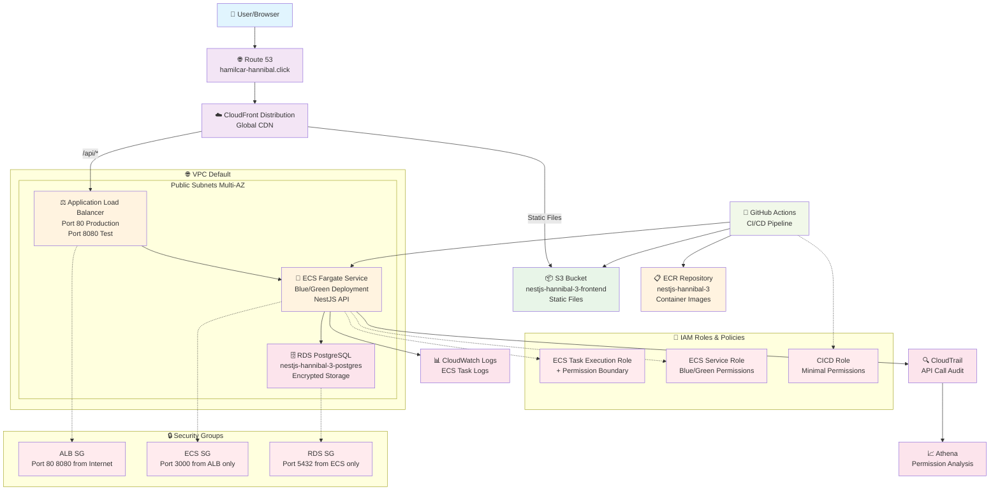

# NestJS Hannibal 3

企業レベルのNestJS + AWS ECS Fargateアプリケーション

## 📋 ドキュメント

- [セットアップガイド](./docs/setup/README.md) - 環境構築・事前準備
- [運用ガイド](./docs/operations/README.md) - IAM管理・監視・分析
- [アーキテクチャ](./docs/architecture/mermaid/README.md) - システム構成図

## 🏗️ AWSアーキテクチャ

## 🔧 技術スタック

### フロントエンド
- **React + TypeScript**: モダンなUI開発
- **GraphQL**: 効率的なデータ取得
- **Vite**: 高速ビルドツール

### バックエンド
- **NestJS**: エンタープライズ級Node.jsフレームワーク
- **GraphQL + REST**: ハイブリッドAPI設計
- **PostgreSQL**: リレーショナルデータベース

### インフラストラクチャ
- **AWS ECS Fargate**: サーバーレスコンテナ
- **CloudFront + S3**: グローバルCDN
- **Application Load Balancer**: 高可用性ロードバランシング

### CI/CD
- **GitHub Actions**: 自動化パイプライン
- **Docker**: コンテナ化
- **Terraform**: Infrastructure as Code

## 🔐 AWS Professional設計

### 設計原則
- **基盤とアプリケーションの分離**: IAMユーザー・基本ロールは永続化
- **最小権限原則**: CloudTrail分析による権限最適化（160個→76個、52%削減）
- **Infrastructure as Code**: Terraformによる完全なインフラ管理
- **無停止デプロイメント**: ECS Native Blue/Green Deployment

### セキュリティ
- **Permission Boundary**: 最大権限の制限
- **CloudTrail監査**: 全API呼び出しの記録・分析
- **AssumeRole**: 環境別権限分離