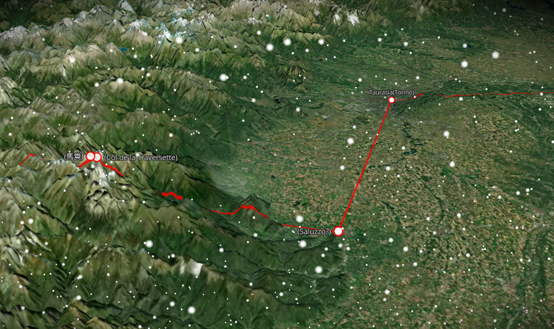

# terraform-hannibal

Terraform / AWS / GitHub Actions を使い、ECS Fargate ベースのアプリケーション基盤と、Issue → Branch → PR → CI → Merge の変更管理ガードレールを構築した DevOps / SRE / Platform Engineering 向けポートフォリオ。

## 採用担当者向けサマリー（30秒）

- **対象ロール**: DevOps Engineer / SRE / Platform Engineer / インフラエンジニア
- **基盤構成**: Terraform で ECS Fargate / ALB / CloudFront / RDS / S3 / Route53 / CloudTrail / Athena を管理
- **CI/CD**: GitHub Actions から provisioning / Blue-Green / Canary / destroy を実行
- **変更管理**: Issue / Branch / PR / Label / CI により、目的・影響範囲・rollback・レビュー観点を追跡
- **ADR**: WAF / GuardDuty / Terraform state locking / IAM Role 分離などの主要な設計判断・採択理由・影響を記録（[docs/adr/README.md](./docs/adr/README.md)）
- **AI Agent 対応**: AI Agent / CLI / GitHub UI 経由の作業でも、人間確認とCIによりレビュー可能な履歴を残す設計
- **セルフサービス運用**: 環境のオンデマンド起動・停止に加え、CloudWatch Alarm / ECS / CodeDeploy / Terraform state / rollback の初動手順を Runbook として整備
- **コスト設計**: 通常停止運用により、稼働時の月額約 $30-50 から停止時約 $5 まで抑制
- **外部の技術発信**: Terraform / AWS / GitHub Actions / DevOps 周辺の記事を掲載（[https://zenn.dev/kmryst](https://zenn.dev/kmryst)）

## 一番見てほしいポイント

開発者・運用者・AI Agent が安全に変更を流せる Platform / DevOps 基盤の設計。変更の目的・影響・検証・戻し方を追える状態にすることを主眼に置いている。

### 1. AI Agent が関与してもレビュー可能な運用

AI Agent の作業は、実装前の計画提示を運用ルールとし、PR 作成後は Issue link / label / rollback 欄 / CI で機械的に検査する。AI が関与した変更でも意図・判断・差分・検証結果を追跡できる変更管理として設計している。

### 2. 変更管理のガードレール

Issue では `目的` / `対象` / `受け入れ条件` と `type` / `area` / `risk` / `cost` ラベルを必須化。PR では Issue link、必須ラベル、厳密運用時の rollback 欄を `PR Policy Check` で検査する。運用ルールは [CONTRIBUTING.md](./CONTRIBUTING.md)、設計意図は [GitHub Flow Guardrails](./docs/operations/github-flow-guardrails.md) に分離。

### 3. セルフサービス運用と品質ゲート

GitHub Actions から provisioning / Blue-Green / Canary / destroy を実行できる。PR では Terraform fmt/validate、TFLint、Trivy Config、Gitleaks を実行し、週次/手動の [Security Scan](./.github/workflows/security-scan.yml) で CodeQL と Trivy dependency/container scan を確認する。

## アーキテクチャ概要

  

| レイヤー | 構成 |
|---|---|
| Edge / DNS | Route53、CloudFront |
| Load Balancing | ALB、Blue/Green 用 target group |
| Compute | ECS Fargate、CodeDeploy Blue/Green |
| Data | RDS PostgreSQL、private data subnet |
| Static frontend | S3 + CloudFront OAC |
| Audit / Cost | CloudTrail、Athena、CloudWatch、Billing alarm |
| State | S3 backend + S3 lockfile（DynamoDB lock は移行期間中のみ併用） |

詳細な構成は [Architecture Docs](./docs/architecture/) と [Terraform Modules](./docs/architecture/terraform-modules.md) を参照。

## GitHub運用と品質ゲート

| 領域 | 実装内容 | 証跡 |
|---|---|---|
| Issue | 最小本文項目と必須ラベルを検査 | [Issue Form](./.github/ISSUE_TEMPLATE/feature_request.yml) |
| PR | Issue link、必須ラベル、rollback 欄を検査 | [PR template](./.github/pull_request_template.md) |
| Policy | 軽運用 / 厳密運用を判定 | [pr-check.yml](./.github/workflows/pr-check.yml) |
| Commit | PR title とコミットメッセージを Conventional Commits で統一 | [CONTRIBUTING.md](./CONTRIBUTING.md) |
| IaC | Terraform fmt/validate、plan artifact、TFLint | [Quality Gates](./docs/operations/quality-gates.md) |
| Security | Trivy Config、Gitleaks、CodeQL、Trivy dependency/container scan | [Security Design](./docs/architecture/security-design.md) |

Trivy Config の検出結果は初期導入時点では review signal として扱い、即時修正・accepted risk・後続検討に分けて Issue 化している（例: [#231](https://github.com/kmryst/terraform-hannibal/issues/231), [#233](https://github.com/kmryst/terraform-hannibal/issues/233)）。

## CI/CD と運用

| Workflow | 役割 |
|---|---|
| [deploy.yml](./.github/workflows/deploy.yml) | `provisioning` / `bluegreen` / `canary` を手動選択し、PR gate 通過済みの `main` から Terraform apply と CodeDeploy を実行 |
| [destroy.yml](./.github/workflows/destroy.yml) | 利用終了後に `DESTROY` 入力で一時リソース（ECS / RDS / ALB などアプリ実行系）を停止・削除 |
| [pr-check.yml](./.github/workflows/pr-check.yml) | PR policy、commitlint、backend/frontend build/test、Docker build、Terraform check、TFLint、Trivy Config、Gitleaks |
| [security-scan.yml](./.github/workflows/security-scan.yml) | 週次/手動の CodeQL、Trivy dependency scan、container scan |
| [sync-labels.yml](./.github/workflows/sync-labels.yml) | `.github/labels.yml` を GitHub labels に同期 |

`deploy.yml` は backend/frontend test を再実行しない。コード品質の確認は PR gate（`pr-check.yml`）に一本化し、deploy workflow は `main` からの手動デプロイに集中させる。
`security-scan.yml` は毎週月曜 00:15 UTC（09:15 JST）と手動実行で動かす。PR ごとの軽量 gate は `pr-check.yml` に寄せ、Docker build や CodeQL を含む重めの scan は定期監査として GitHub Security に残す。

Blue/Green / Canary の詳細は [CodeDeploy Blue/Green](./docs/deployment/codedeploy-blue-green.md) を参照。

## セキュリティとコスト設計

| 観点 | 設計 |
|---|---|
| IAM | Permission Boundary + GitHub OIDC AssumeRole で自動化権限を制御 |
| Network | 3層 VPC、private subnet 上の ECS / RDS、DB 層は外部非公開 |
| Audit | CloudTrail を S3 に集約し、Athena で監査ログを分析 |
| Secrets | Gitleaks で secret 混入を PR 時に検出 |
| IaC security | Trivy Config で Terraform / Dockerfile の設定ミスを review signal として検出 |
| Cost | 環境を通常停止し、必要時だけ起動する運用で固定費を抑制。コスト前提は [Operations Docs](./docs/operations/README.md) に記録 |
| Accepted risk | WAF / GuardDuty などコスト影響が大きい機能は、showcase 用途・外部公開範囲・コスト影響・再検討条件を [Security Design](./docs/architecture/security-design.md) に残す方針 |

IAM / OIDC / Permission Boundary の詳細は [IAM Management](./docs/operations/iam-management.md) と [PR Terraform Plan Role Design](./docs/operations/pr-terraform-plan-role-design.md) を参照。主要な設計判断の根拠は ADR（[docs/adr/README.md](./docs/adr/README.md)）に記録。

## デモと証跡

この環境はコスト抑制のため通常停止。必要時は GitHub Actions から provisioning / deploy / destroy を実行でき、起動前でも docs / Actions / Issues / PRs から設計意図と運用履歴を確認できる。

- デモURL: [hamilcar-hannibal.click](https://hamilcar-hannibal.click)（通常停止中）

**アプリ画面（停止中のため参考スクリーンショット）**

  

動作の様子は [docs/screenshots/hannibal_1_middle.gif](docs/screenshots/hannibal_1_middle.gif) を参照。

- 起動: [deploy.yml](./.github/workflows/deploy.yml) の `provisioning` / `bluegreen` / `canary`
- 停止: [destroy.yml](./.github/workflows/destroy.yml) の `DESTROY` 確認付き workflow
- 構成図: [docs/architecture/](./docs/architecture/)
- セキュリティ・IAM: [Security Design](./docs/architecture/security-design.md) / [IAM Analysis](./docs/security/iam-analysis/README.md)
- トラブルシュート: [docs/troubleshooting/README.md](./docs/troubleshooting/README.md)

## 代表的な改善と学び

Issue / PR / Label / CI のガードレール整備後から、面接で深掘りしやすい実例を抜粋。詳細な問題・対応・結果は [Quality Gates](./docs/operations/quality-gates.md)、[GitHub Flow Guardrails](./docs/operations/github-flow-guardrails.md)、[Troubleshooting](./docs/troubleshooting/README.md) を参照。

- **Issue / PR / Label / CI のガードレール整備** 
  任意運用 → type / area / risk / cost、Issue link、rollback 欄を PR Policy Check で機械的に検査（例: [#92](https://github.com/kmryst/terraform-hannibal/issues/92), [#93](https://github.com/kmryst/terraform-hannibal/pull/93)）
- **PR Terraform plan レビュー基盤の追加** 
  deploy / apply 用 role 共用 → pull_request context 限定の PR plan 専用 role（HannibalPRPlanRole-Dev）を新設し、plan artifact・Job Summary・危険シグナル抽出で差分・影響範囲をレビュー可能にした（例: [#121](https://github.com/kmryst/terraform-hannibal/issues/121), [#135](https://github.com/kmryst/terraform-hannibal/pull/135)）
- **AI Agent 作業の履歴品質改善** 
  明文化なし → 実装前計画提示と Conventional Commits 遵守を CONTRIBUTING.md / CLAUDE.md に明文化し、AI Agent が生成した変更でも PR title・コミットメッセージ・実装前計画を同じ基準で確認できるようにした（例: [#152](https://github.com/kmryst/terraform-hannibal/issues/152), [#200](https://github.com/kmryst/terraform-hannibal/issues/200)）
- **IaC security scan 導入と Trivy 検出の棚卸し** 
  PR CI に lint / scan なし → TFLint / Trivy Config / Gitleaks を PR CI に統合し、検出結果を修正対象・accepted risk・後続検討に分類して Issue 化した（例: [#226](https://github.com/kmryst/terraform-hannibal/issues/226), [#227](https://github.com/kmryst/terraform-hannibal/pull/227)）
- **IAM / OIDC 権限の段階的な最小権限化** 
  deploy / plan の権限混在 → role 分離と Permission Boundary により、用途ごとの権限範囲を分けて blast radius を抑制（例: [#129](https://github.com/kmryst/terraform-hannibal/issues/129), [#179](https://github.com/kmryst/terraform-hannibal/pull/179)）

## 技術スタック

### Primary stack

| 領域 | 技術 |
|---|---|
| IaC | Terraform 1.12.1 |
| AWS | ECS Fargate、ALB、CloudFront、RDS PostgreSQL、S3、Route53、CloudTrail、Athena、CloudWatch |
| CI/CD | GitHub Actions、CodeDeploy Blue/Green、Canary deployment |
| Identity / Security | IAM、OIDC、Permission Boundary、TFLint、Trivy、Gitleaks、CodeQL |
| Operations | Issue Forms、PR template、label policy、required checks、deploy / destroy workflows |

### Application used as deployment target

| 領域 | 技術 |
|---|---|
| Backend | NestJS、TypeScript、GraphQL、PostgreSQL |
| Frontend | React、Vite、Apollo Client、Mapbox GL JS |

## 詳細ドキュメント

- [CONTRIBUTING.md](./CONTRIBUTING.md) / [GitHub Flow Guardrails](./docs/operations/github-flow-guardrails.md): GitHub運用ルールと設計意図
- [Terraform Runbook](./docs/operations/terraform-runbook.md) / [Terraform Rollback Plan](./docs/operations/rollback-plan.md): Terraform 運用手順、state lock、import、drift 確認、state 復元
- [Quality Gates](./docs/operations/quality-gates.md): PR 品質ゲートとセキュリティチェック
- [IAM Management](./docs/operations/iam-management.md) / [PR Terraform Plan Role Design](./docs/operations/pr-terraform-plan-role-design.md): IAM / OIDC / Permission Boundary
- [CodeDeploy Blue/Green](./docs/deployment/codedeploy-blue-green.md): 無停止切替と段階配信
- [Architecture Docs](./docs/architecture/) / [Security Design](./docs/architecture/security-design.md): システム構成とセキュリティ設計
- [ADR](./docs/adr/README.md): 主要な設計判断・採択理由・影響の記録
- [Troubleshooting](./docs/troubleshooting/README.md): 実装時の課題と解決

---

**最終更新**: 2026年6月2日 JST
