# NestJS Hannibal 3

## 🚀 セットアップ手順

### **⚠️ 重要: ECRリポジトリの事前作成**
GitHub Actionsを実行する前に、ECRリポジトリを手動で作成してください。

```bash
# 一度だけ実行（プロジェクト初期セットアップ時）
aws ecr create-repository --repository-name nestjs-hannibal-3 --region ap-northeast-1

# 作成確認
aws ecr describe-repositories --repository-names nestjs-hannibal-3 --region ap-northeast-1
```

**理由**: CI/CDの安定性向上、権限エラー回避、実行時間短縮

### **開発環境セットアップ**
1. ✅ ECRリポジトリ作成（上記参照）
2. `npm install`
3. 環境変数設定
4. GitHub Actionsの実行

## 📦 アーキテクチャ

```mermaid

graph TB
    User[ユーザー] --> CF[CloudFront Distribution]
    
    CF --> S3[S3 Bucket<br/>Frontend Static Files]
    CF --> ALB[Application Load Balancer]
    
    ALB --> ECS[ECS Fargate Service<br/>API Backend]
    ECS --> ECR[ECR<br/>Container Images]
    
    subgraph "VPC"
        subgraph "Public Subnets"
            ALB
            ECS
        end
    end
    
    subgraph "Security Groups"
        ALB_SG[ALB Security Group<br/>Port 80 from 0.0.0.0/0]
        ECS_SG[ECS Security Group<br/>Port 3000 from ALB only]
    end
    
    subgraph "IAM"
        ECS_Role[ECS Task Execution Role<br/>ECR Pull Permissions]
    end
    
    subgraph "Monitoring"
        CW[CloudWatch Logs<br/>ECS Task Logs]
    end
    
    ALB -.-> ALB_SG
    ECS -.-> ECS_SG
    ECS -.-> ECS_Role
    ECS --> CW
    
    CF --> |/api/*| ALB
    CF --> |Static Files| S3

```


