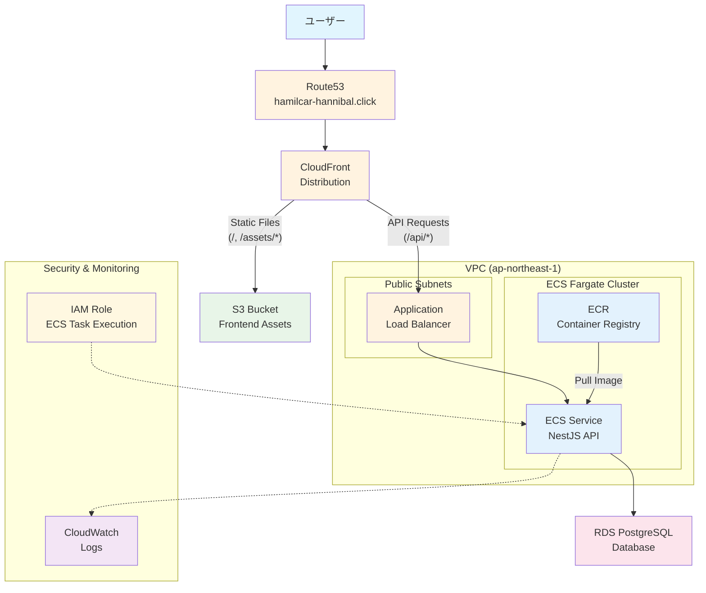

# NestJS Hannibal 3 Architecture

## システム構成図

## コンポーネント詳細

### Frontend & CDN
- **Route53**: DNS管理とドメイン解決
- **CloudFront**: CDN、静的ファイル配信とAPIプロキシ
- **S3**: React アプリケーションの静的ファイル保存

### Application Layer
- **ALB**: HTTPSトラフィックの負荷分散
- **ECS Fargate**: NestJS APIのコンテナ実行環境
- **ECR**: Dockerイメージの保存とバージョン管理

### Database Layer
- **RDS PostgreSQL**: アプリケーションデータの永続化

### Security & Monitoring
- **IAM Role**: ECSタスクの実行権限管理
- **CloudWatch**: アプリケーションログとメトリクス監視

## トラフィックフロー

1. **静的ファイル**: User → Route53 → CloudFront → S3
2. **API リクエスト**: User → Route53 → CloudFront → ALB → ECS → RDS
3. **デプロイ**: ECR → ECS (新しいコンテナイメージのプル)
4. **監視**: ECS → CloudWatch (ログとメトリクス送信)