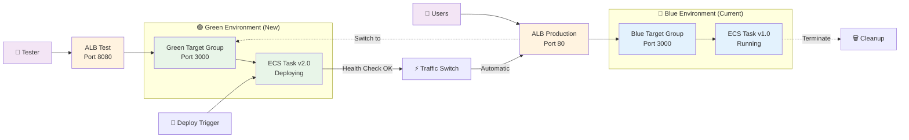

# Blue/Green Deployment

## 🔄 ECS Native Blue/Green Deployment

## 🎯 デプロイメント手順

### 1. 準備フェーズ
- 新しいコンテナイメージをECRにプッシュ
- Green環境用のタスク定義を作成

### 2. デプロイフェーズ
- Green環境でECSタスクを起動
- ヘルスチェックで正常性を確認
- テストリスナー（Port 8080）で事前検証

### 3. 切り替えフェーズ
- プロダクションリスナー（Port 80）をGreenに切り替え
- Blue環境のタスクを自動終了
- 完全な無停止デプロイメント完了

## ⚡ 主要メリット

### CodeDeploy不要
- **ECS単体**: CodeDeployアプリケーション・デプロイメントグループが不要
- **シンプル**: 複雑な設定や依存関係を排除
- **高速**: デプロイ時間の短縮

### 無停止デプロイ
- **ゼロダウンタイム**: ユーザーへの影響なし
- **自動ロールバック**: ヘルスチェック失敗時の自動復旧
- **Dark Canary**: 本番トラフィック前のテスト可能

### 企業レベル品質
- **Netflix方式**: 大規模サービスで実証済み
- **監査対応**: 全デプロイ履歴をCloudTrailで追跡
- **Permission Boundary**: 最小権限でのセキュア運用