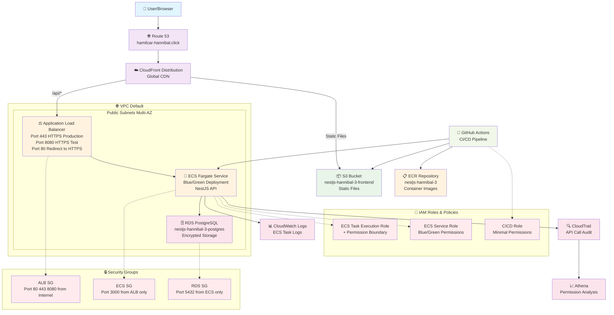

# 全体システム構成

## 🏗️ システムアーキテクチャ

## 🔧 技術スタック

### フロントエンド
- **React + TypeScript**: モダンなUI開発
- **GraphQL**: 効率的なデータ取得
- **Vite**: 高速ビルドツール

### バックエンド
- **NestJS**: エンタープライズ級Node.jsフレームワーク
- **GraphQL + REST**: ハイブリッドAPI設計
- **PostgreSQL**: リレーショナルデータベース

### インフラストラクチャ
- **AWS ECS Fargate**: サーバーレスコンテナ
- **CloudFront + S3**: グローバルCDN
- **Application Load Balancer**: 高可用性ロードバランシング

### CI/CD
- **GitHub Actions**: 自動化パイプライン
- **Docker**: コンテナ化
- **Terraform**: Infrastructure as Code
