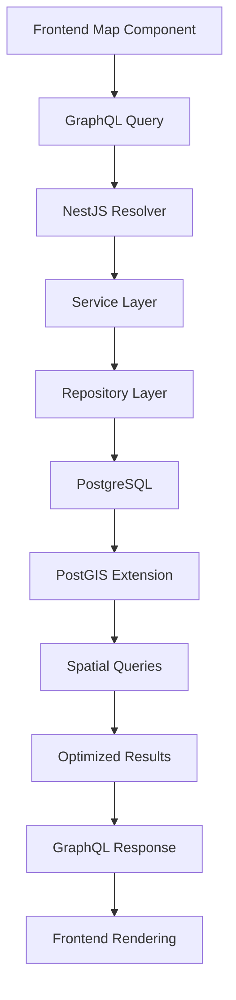

# Data Architecture - NestJS Hannibal 3

## データアーキテクチャ概要
ハンニバルのアルプス越えルートデータを効率的に管理・配信するためのデータ設計

## データモデル設計（実装済み）

### 実装されているデータモデル

**TypeORM Entity: `src/entities/route.entity.ts`**

```typescript
@Entity('routes')
export class Route {
  @PrimaryGeneratedColumn()
  id: number;

  @Column({ length: 255 })
  name: string;

  @Column('text')
  description: string;

  @Column('jsonb')
  coordinates: number[][];  // [[lng, lat], [lng, lat], ...]

  @Column({ length: 100, nullable: true })
  color?: string;

  @CreateDateColumn()
  createdAt: Date;

  @UpdateDateColumn()
  updatedAt: Date;
}
```

**PostgreSQL テーブル定義:**
```sql
CREATE TABLE routes (
    id SERIAL PRIMARY KEY,
    name VARCHAR(255) NOT NULL,
    description TEXT NOT NULL,
    coordinates JSONB NOT NULL,  -- GeoJSON座標配列
    color VARCHAR(100),
    "createdAt" TIMESTAMP DEFAULT CURRENT_TIMESTAMP,
    "updatedAt" TIMESTAMP DEFAULT CURRENT_TIMESTAMP
);
```

### データモデルの特徴

1. **JSONB型**: 座標データをPostgreSQLのJSONB型で保存
   - フレキシブルなデータ構造
   - インデックス可能（GIN/GiSTインデックス）
   - ネイティブJSON関数でクエリ最適化

2. **シンプル設計**: 複雑な正規化を避け、パフォーマンス重視
   - 座標は routes テーブルに直接保存
   - 別テーブル分割なし（データ量が小規模なため）

3. **TypeORM統合**: TypeScriptの型安全性を保持
   - GraphQL Code First と連携
   - 自動マイグレーション対応（開発環境のみ）

### GraphQLスキーマ設計（実装済み）

**GraphQL Code First による自動生成スキーマ:**

```graphql
type Route {
  id: ID!
  name: String!
  description: String!
  coordinates: [[Float!]!]!  # JSONB形式の座標配列
  color: String
  createdAt: DateTime!
  updatedAt: DateTime!
}

# GeoJSON形式のクエリ
type Query {
  # 全ルート取得
  routes: [Route!]!
  
  # 特定ルート取得
  route(id: ID!): Route
  
  # GeoJSON形式のハンニバルルート
  hannibalRoute: HannibalRouteCollection!
  
  # GeoJSON形式のポイントルート
  pointRoute: PointRouteCollection!
}

# GeoJSON Collection型
type HannibalRouteCollection {
  type: String!
  features: [HannibalRouteFeature!]!
}

type HannibalRouteFeature {
  type: String!
  properties: HannibalRouteProperties!
  geometry: GeometryLineString!
}

type GeometryLineString {
  type: String!
  coordinates: [[Float!]!]!
}

type HannibalRouteProperties {
  name: String!
}
```

### 実装されているクエリ

```typescript
// src/modules/route/route.resolver.ts
@Resolver(() => Route)
export class RouteResolver {
  @Query(() => [Route])
  async routes(): Promise<Route[]> {
    return this.routeService.findAll();
  }

  @Query(() => Route, { nullable: true })
  async route(@Args('id', { type: () => Int }) id: number): Promise<Route> {
    return this.routeService.findOne(id);
  }

  @Query('hannibalRoute')
  async hannibalRoute() {
    return this.routeService.getHannibalRouteGeoJSON();
  }

  @Query('pointRoute')
  async pointRoute() {
    return this.routeService.getPointRouteGeoJSON();
  }
}
```

## データフロー設計

### リアルタイムデータフロー


### バッチデータ処理


## データクエリ最適化（実装済み）

### JSONB型の活用

**PostgreSQL JSONB クエリ例:**
```sql
-- 座標データから特定地点を検索
SELECT id, name, 
       jsonb_array_length(coordinates) as point_count
FROM routes
WHERE coordinates @> '[[7.0, 46.0]]';

-- GINインデックス作成（JSONB高速検索）
CREATE INDEX idx_routes_coordinates 
ON routes USING GIN (coordinates);
```

### TypeORMによるクエリ最適化

```typescript
// src/modules/route/route.service.ts
@Injectable()
export class RouteService {
  constructor(
    @InjectRepository(Route)
    private routeRepository: Repository<Route>,
  ) {}

  async findAll(): Promise<Route[]> {
    // シンプルなSELECT文（全カラム取得）
    return this.routeRepository.find({
      order: { createdAt: 'DESC' },
    });
  }

  async findOne(id: number): Promise<Route> {
    return this.routeRepository.findOne({
      where: { id },
    });
  }

  // GeoJSON形式への変換
  async getHannibalRouteGeoJSON() {
    const routes = await this.findAll();
    return {
      type: 'FeatureCollection',
      features: routes.map(route => ({
        type: 'Feature',
        properties: { name: route.name },
        geometry: {
          type: 'LineString',
          coordinates: route.coordinates,
        },
      })),
    };
  }
}
```

## 将来実装予定の最適化

### PostGIS拡張機能（未実装）
- 空間インデックス（GIST/GIN）
- 地理的範囲検索（ST_Within、ST_DWithin）
- ルート計算（ST_Length、ST_Distance）

### 理由
- 現在のデータ量では不要（ルート数が少ない）
- JSONB型で十分なパフォーマンス
- 将来的なデータ増加時に実装予定

## キャッシュ戦略（部分実装）

### 実装済みキャッシュ

#### CloudFront CDN キャッシュ
```hcl
# terraform/modules/cdn/cloudfront/main.tf
resource "aws_cloudfront_distribution" "main" {
  default_cache_behavior {
    default_ttl = 86400    # 1日
    max_ttl     = 31536000 # 1年
    min_ttl     = 0
  }
}
```

**特徴:**
- 静的コンテンツ（React ビルド成果物）をグローバルキャッシュ
- エッジロケーションでの高速配信
- オリジン（S3/ALB）への負荷軽減

### 将来実装予定のキャッシュ

#### Redis キャッシュ（未実装）
```typescript
// 将来実装予定
@Injectable()
export class RouteService {
  constructor(
    private routeRepository: Repository<Route>,
    @Inject(CACHE_MANAGER) private cacheManager: Cache,
  ) {}

  async getRoute(id: number): Promise<Route> {
    const cacheKey = `route:${id}`;
    
    // L1: Redisキャッシュ
    let route = await this.cacheManager.get<Route>(cacheKey);
    
    if (!route) {
      // L2: PostgreSQL
      route = await this.routeRepository.findOne({ where: { id } });
      
      // キャッシュに保存 (TTL: 1時間)
      await this.cacheManager.set(cacheKey, route, 3600);
    }
    
    return route;
  }
}
```

#### DataLoader による N+1 問題解決（未実装）
```typescript
// 将来実装予定
@Injectable()
export class RouteLoader {
  private readonly loader = new DataLoader<number, Route>(
    async (ids: number[]) => {
      const routes = await this.routeRepository
        .findByIds(ids);
      
      return ids.map(id => 
        routes.find(route => route.id === id)
      );
    }
  );

  async load(id: number): Promise<Route> {
    return this.loader.load(id);
  }
}
```

### 未実装の理由
- **データ量が少ない**: ルート数が限定的（キャッシュ不要）
- **コスト最適化**: Redis/ElastiCache の追加コストを回避
- **シンプル設計**: PostgreSQL JSONB で十分なパフォーマンス

## データ品質管理

### バリデーション設計
```typescript
// 座標データバリデーション
@Entity()
export class RouteCoordinate {
  @Column('decimal', { precision: 10, scale: 8 })
  @IsLatitude()
  @Min(-90)
  @Max(90)
  latitude: number;

  @Column('decimal', { precision: 11, scale: 8 })
  @IsLongitude()
  @Min(-180)
  @Max(180)
  longitude: number;

  @Column('integer', { nullable: true })
  @IsOptional()
  @Min(-500) // 海面下500m
  @Max(9000) // エベレスト級
  elevationM?: number;
}
```

### データ整合性チェック
```sql
-- 座標順序整合性チェック
CREATE OR REPLACE FUNCTION validate_coordinate_sequence()
RETURNS TRIGGER AS $$
BEGIN
  -- 同一ルート内での順序重複チェック
  IF EXISTS (
    SELECT 1 FROM route_coordinates 
    WHERE route_id = NEW.route_id 
    AND sequence_order = NEW.sequence_order 
    AND id != NEW.id
  ) THEN
    RAISE EXCEPTION 'Duplicate sequence order for route %', NEW.route_id;
  END IF;
  
  RETURN NEW;
END;
$$ LANGUAGE plpgsql;

CREATE TRIGGER coordinate_sequence_check
  BEFORE INSERT OR UPDATE ON route_coordinates
  FOR EACH ROW EXECUTE FUNCTION validate_coordinate_sequence();
```

## パフォーマンス最適化

### データベース最適化
```sql
-- 複合インデックス作成
CREATE INDEX idx_route_coordinates_route_sequence 
ON route_coordinates (route_id, sequence_order);

-- 部分インデックス (アクティブルートのみ)
CREATE INDEX idx_active_routes 
ON routes (created_at) 
WHERE deleted_at IS NULL;

-- 統計情報更新
ANALYZE route_coordinates;
ANALYZE routes;
```

### クエリ最適化
```typescript
// DataLoader による N+1 問題解決
@Injectable()
export class CoordinateLoader {
  private readonly loader = new DataLoader<string, RouteCoordinate[]>(
    async (routeIds: string[]) => {
      const coordinates = await this.coordinateRepository
        .createQueryBuilder('coord')
        .where('coord.routeId IN (:...routeIds)', { routeIds })
        .orderBy('coord.sequenceOrder', 'ASC')
        .getMany();

      return routeIds.map(routeId =>
        coordinates.filter(coord => coord.routeId === routeId)
      );
    }
  );

  async loadByRouteId(routeId: string): Promise<RouteCoordinate[]> {
    return this.loader.load(routeId);
  }
}
```

## データ移行・バックアップ

### 移行戦略
```sql
-- 段階的データ移行
BEGIN;

-- 1. 新テーブル作成
CREATE TABLE routes_new (LIKE routes INCLUDING ALL);

-- 2. データ変換・移行
INSERT INTO routes_new (name, description, difficulty_level)
SELECT 
  route_name,
  route_desc,
  CASE 
    WHEN difficulty = 'easy' THEN 1
    WHEN difficulty = 'moderate' THEN 3
    WHEN difficulty = 'hard' THEN 5
  END
FROM legacy_routes;

-- 3. テーブル切り替え
ALTER TABLE routes RENAME TO routes_old;
ALTER TABLE routes_new RENAME TO routes;

COMMIT;
```

### バックアップ設定
```bash
#!/bin/bash
# 自動バックアップスクリプト

# 地理データの完全バックアップ
pg_dump \
  --host=$DB_HOST \
  --username=$DB_USER \
  --format=custom \
  --compress=9 \
  --file="hannibal_backup_$(date +%Y%m%d_%H%M%S).dump" \
  hannibal_db

# S3へのアップロード
aws s3 cp hannibal_backup_*.dump s3://nestjs-hannibal-3-backups/database/
```

## 監視・メトリクス

### データベース監視
```sql
-- クエリパフォーマンス監視
SELECT 
  query,
  calls,
  total_time,
  mean_time,
  rows
FROM pg_stat_statements 
WHERE query LIKE '%route%'
ORDER BY total_time DESC
LIMIT 10;
```

### アプリケーションメトリクス
```typescript
// Prometheus メトリクス
@Injectable()
export class MetricsService {
  private readonly queryDuration = new Histogram({
    name: 'graphql_query_duration_seconds',
    help: 'GraphQL query duration',
    labelNames: ['operation', 'status'],
  });

  recordQueryDuration(operation: string, duration: number, status: string) {
    this.queryDuration.labels(operation, status).observe(duration);
  }
}
```

---
**最終更新**: 2025年10月12日  
**データモデル**: シンプル設計（Route Entity のみ、JSONB型座標）  
**実装状況**: TypeORM + PostgreSQL 15 + GraphQL Code First