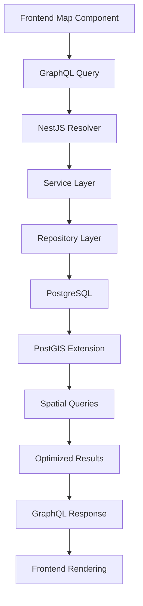

# Data Architecture - NestJS Hannibal 3

## データアーキテクチャ概要
ハンニバルのアルプス越えルートデータを効率的に管理・配信するためのデータ設計

## データモデル設計

### 地理データモデル
```sql
-- ルートマスターテーブル
CREATE TABLE routes (
    id SERIAL PRIMARY KEY,
    name VARCHAR(100) NOT NULL,
    description TEXT,
    difficulty_level INTEGER CHECK (difficulty_level BETWEEN 1 AND 5),
    total_distance_km DECIMAL(8,2),
    estimated_duration_days INTEGER,
    historical_context TEXT,
    created_at TIMESTAMP DEFAULT CURRENT_TIMESTAMP,
    updated_at TIMESTAMP DEFAULT CURRENT_TIMESTAMP
);

-- 座標データテーブル
CREATE TABLE route_coordinates (
    id SERIAL PRIMARY KEY,
    route_id INTEGER REFERENCES routes(id) ON DELETE CASCADE,
    sequence_order INTEGER NOT NULL,
    latitude DECIMAL(10,8) NOT NULL,
    longitude DECIMAL(11,8) NOT NULL,
    elevation_m INTEGER,
    location_name VARCHAR(100),
    waypoint_type VARCHAR(20) CHECK (waypoint_type IN ('start', 'waypoint', 'camp', 'battle', 'end')),
    created_at TIMESTAMP DEFAULT CURRENT_TIMESTAMP
);

-- 地形データテーブル
CREATE TABLE terrain_features (
    id SERIAL PRIMARY KEY,
    coordinate_id INTEGER REFERENCES route_coordinates(id),
    feature_type VARCHAR(50) NOT NULL, -- 'mountain', 'river', 'pass', 'valley'
    feature_name VARCHAR(100),
    difficulty_modifier DECIMAL(3,2) DEFAULT 1.0,
    seasonal_accessibility JSONB, -- 季節別アクセス可能性
    created_at TIMESTAMP DEFAULT CURRENT_TIMESTAMP
);
```

### GraphQLスキーマ設計
```graphql
type Route {
  id: ID!
  name: String!
  description: String
  difficultyLevel: Int!
  totalDistanceKm: Float
  estimatedDurationDays: Int
  historicalContext: String
  coordinates: [RouteCoordinate!]!
  terrainFeatures: [TerrainFeature!]!
  createdAt: DateTime!
  updatedAt: DateTime!
}

type RouteCoordinate {
  id: ID!
  sequenceOrder: Int!
  latitude: Float!
  longitude: Float!
  elevationM: Int
  locationName: String
  waypointType: WaypointType!
  terrainFeatures: [TerrainFeature!]!
}

enum WaypointType {
  START
  WAYPOINT
  CAMP
  BATTLE
  END
}

type TerrainFeature {
  id: ID!
  featureType: String!
  featureName: String
  difficultyModifier: Float!
  seasonalAccessibility: JSON
}

# クエリ定義
type Query {
  # 全ルート取得
  routes: [Route!]!
  
  # 特定ルート取得
  route(id: ID!): Route
  
  # 難易度別ルート検索
  routesByDifficulty(level: Int!): [Route!]!
  
  # 地理的範囲でのルート検索
  routesInBounds(
    northEast: CoordinateInput!
    southWest: CoordinateInput!
  ): [Route!]!
}

input CoordinateInput {
  latitude: Float!
  longitude: Float!
}
```

## データフロー設計

### リアルタイムデータフロー


### バッチデータ処理


## 空間データ最適化

### PostGIS拡張機能
```sql
-- PostGIS拡張有効化
CREATE EXTENSION IF NOT EXISTS postgis;

-- 空間インデックス作成
CREATE INDEX idx_route_coordinates_geom 
ON route_coordinates 
USING GIST (ST_Point(longitude, latitude));

-- 空間クエリ例
SELECT r.name, rc.latitude, rc.longitude
FROM routes r
JOIN route_coordinates rc ON r.id = rc.route_id
WHERE ST_DWithin(
    ST_Point(rc.longitude, rc.latitude)::geography,
    ST_Point(7.0, 46.0)::geography, -- アルプス中心部
    50000 -- 50km範囲
);
```

### 地理データ最適化
```typescript
// NestJS Repository with spatial queries
@Injectable()
export class RouteRepository {
  constructor(
    @InjectRepository(Route)
    private routeRepository: Repository<Route>,
  ) {}

  async findRoutesInBounds(
    northEast: Coordinate,
    southWest: Coordinate,
  ): Promise<Route[]> {
    return this.routeRepository
      .createQueryBuilder('route')
      .leftJoinAndSelect('route.coordinates', 'coord')
      .where(
        `ST_Within(
          ST_Point(coord.longitude, coord.latitude),
          ST_MakeEnvelope(:swLng, :swLat, :neLng, :neLat, 4326)
        )`,
        {
          swLng: southWest.longitude,
          swLat: southWest.latitude,
          neLng: northEast.longitude,
          neLat: northEast.latitude,
        },
      )
      .getMany();
  }
}
```

## キャッシュ戦略

### 多層キャッシュ設計
```typescript
// Redis キャッシュ実装
@Injectable()
export class RouteService {
  constructor(
    private routeRepository: RouteRepository,
    @Inject(CACHE_MANAGER) private cacheManager: Cache,
  ) {}

  async getRoute(id: string): Promise<Route> {
    const cacheKey = `route:${id}`;
    
    // L1: メモリキャッシュ
    let route = await this.cacheManager.get<Route>(cacheKey);
    
    if (!route) {
      // L2: データベース
      route = await this.routeRepository.findById(id);
      
      if (route) {
        // キャッシュに保存 (TTL: 1時間)
        await this.cacheManager.set(cacheKey, route, 3600);
      }
    }
    
    return route;
  }
}
```

### CDNキャッシュ設定
```typescript
// GraphQL レスポンスキャッシュ
@Resolver(() => Route)
export class RouteResolver {
  @Query(() => [Route])
  @CacheControl({ maxAge: 3600 }) // 1時間キャッシュ
  async routes(): Promise<Route[]> {
    return this.routeService.findAll();
  }

  @Query(() => Route)
  @CacheControl({ maxAge: 86400 }) // 24時間キャッシュ
  async route(@Args('id') id: string): Promise<Route> {
    return this.routeService.getRoute(id);
  }
}
```

## データ品質管理

### バリデーション設計
```typescript
// 座標データバリデーション
@Entity()
export class RouteCoordinate {
  @Column('decimal', { precision: 10, scale: 8 })
  @IsLatitude()
  @Min(-90)
  @Max(90)
  latitude: number;

  @Column('decimal', { precision: 11, scale: 8 })
  @IsLongitude()
  @Min(-180)
  @Max(180)
  longitude: number;

  @Column('integer', { nullable: true })
  @IsOptional()
  @Min(-500) // 海面下500m
  @Max(9000) // エベレスト級
  elevationM?: number;
}
```

### データ整合性チェック
```sql
-- 座標順序整合性チェック
CREATE OR REPLACE FUNCTION validate_coordinate_sequence()
RETURNS TRIGGER AS $$
BEGIN
  -- 同一ルート内での順序重複チェック
  IF EXISTS (
    SELECT 1 FROM route_coordinates 
    WHERE route_id = NEW.route_id 
    AND sequence_order = NEW.sequence_order 
    AND id != NEW.id
  ) THEN
    RAISE EXCEPTION 'Duplicate sequence order for route %', NEW.route_id;
  END IF;
  
  RETURN NEW;
END;
$$ LANGUAGE plpgsql;

CREATE TRIGGER coordinate_sequence_check
  BEFORE INSERT OR UPDATE ON route_coordinates
  FOR EACH ROW EXECUTE FUNCTION validate_coordinate_sequence();
```

## パフォーマンス最適化

### データベース最適化
```sql
-- 複合インデックス作成
CREATE INDEX idx_route_coordinates_route_sequence 
ON route_coordinates (route_id, sequence_order);

-- 部分インデックス (アクティブルートのみ)
CREATE INDEX idx_active_routes 
ON routes (created_at) 
WHERE deleted_at IS NULL;

-- 統計情報更新
ANALYZE route_coordinates;
ANALYZE routes;
```

### クエリ最適化
```typescript
// DataLoader による N+1 問題解決
@Injectable()
export class CoordinateLoader {
  private readonly loader = new DataLoader<string, RouteCoordinate[]>(
    async (routeIds: string[]) => {
      const coordinates = await this.coordinateRepository
        .createQueryBuilder('coord')
        .where('coord.routeId IN (:...routeIds)', { routeIds })
        .orderBy('coord.sequenceOrder', 'ASC')
        .getMany();

      return routeIds.map(routeId =>
        coordinates.filter(coord => coord.routeId === routeId)
      );
    }
  );

  async loadByRouteId(routeId: string): Promise<RouteCoordinate[]> {
    return this.loader.load(routeId);
  }
}
```

## データ移行・バックアップ

### 移行戦略
```sql
-- 段階的データ移行
BEGIN;

-- 1. 新テーブル作成
CREATE TABLE routes_new (LIKE routes INCLUDING ALL);

-- 2. データ変換・移行
INSERT INTO routes_new (name, description, difficulty_level)
SELECT 
  route_name,
  route_desc,
  CASE 
    WHEN difficulty = 'easy' THEN 1
    WHEN difficulty = 'moderate' THEN 3
    WHEN difficulty = 'hard' THEN 5
  END
FROM legacy_routes;

-- 3. テーブル切り替え
ALTER TABLE routes RENAME TO routes_old;
ALTER TABLE routes_new RENAME TO routes;

COMMIT;
```

### バックアップ設定
```bash
#!/bin/bash
# 自動バックアップスクリプト

# 地理データの完全バックアップ
pg_dump \
  --host=$DB_HOST \
  --username=$DB_USER \
  --format=custom \
  --compress=9 \
  --file="hannibal_backup_$(date +%Y%m%d_%H%M%S).dump" \
  hannibal_db

# S3へのアップロード
aws s3 cp hannibal_backup_*.dump s3://nestjs-hannibal-3-backups/database/
```

## 監視・メトリクス

### データベース監視
```sql
-- クエリパフォーマンス監視
SELECT 
  query,
  calls,
  total_time,
  mean_time,
  rows
FROM pg_stat_statements 
WHERE query LIKE '%route%'
ORDER BY total_time DESC
LIMIT 10;
```

### アプリケーションメトリクス
```typescript
// Prometheus メトリクス
@Injectable()
export class MetricsService {
  private readonly queryDuration = new Histogram({
    name: 'graphql_query_duration_seconds',
    help: 'GraphQL query duration',
    labelNames: ['operation', 'status'],
  });

  recordQueryDuration(operation: string, duration: number, status: string) {
    this.queryDuration.labels(operation, status).observe(duration);
  }
}
```

---
**更新日**: 2025年1月8日  
**データ規模**: 地理座標 10,000+ points, ルート 50+ routes