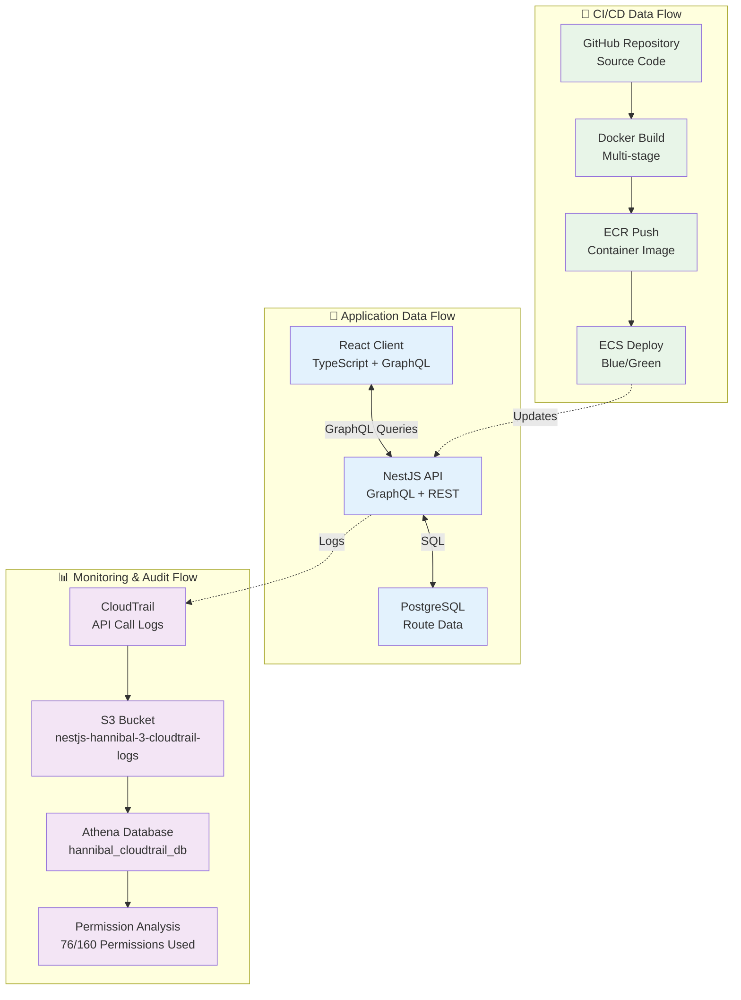

# データフロー & 監査

## 📊 データフロー構成



## 🔍 監査・分析システム

### CloudTrail設定
```json
{
  "TrailName": "nestjs-hannibal-3-cloudtrail",
  "S3BucketName": "nestjs-hannibal-3-cloudtrail-logs",
  "IncludeGlobalServiceEvents": true,
  "IsMultiRegionTrail": true,
  "EnableLogFileValidation": true
}
```

### Athena分析クエリ
```sql
-- CI/CD権限使用状況分析
SELECT 
  CONCAT(
    regexp_replace(record.eventSource, '\.amazonaws\.com$', ''), 
    ':', 
    record.eventName
  ) as permission,
  COUNT(*) as usage_count,
  MIN(record.eventTime) as first_used,
  MAX(record.eventTime) as last_used
FROM hannibal_cloudtrail_db.cloudtrail_logs_partitioned 
CROSS JOIN UNNEST(Records) AS t(record)
WHERE record.userIdentity.arn LIKE '%HannibalCICDRole-Dev%'
  AND record.errorCode IS NULL
  AND year = '2025' AND month = '07' AND day >= '27'
GROUP BY record.eventSource, record.eventName
ORDER BY usage_count DESC
```

## 📈 データ処理パフォーマンス

### GraphQL最適化
- **DataLoader**: N+1問題の解決
- **Query Complexity**: 複雑なクエリの制限
- **Caching**: Redis活用（将来実装）

### データベース設計
```sql
-- ルートデータテーブル
CREATE TABLE routes (
  id SERIAL PRIMARY KEY,
  name VARCHAR(255) NOT NULL,
  geojson JSONB NOT NULL,
  created_at TIMESTAMP DEFAULT NOW(),
  updated_at TIMESTAMP DEFAULT NOW()
);

-- インデックス最適化
CREATE INDEX idx_routes_geojson ON routes USING GIN (geojson);
```

### 監査ログ保持ポリシー
- **CloudTrail**: 永続保存（コンプライアンス要件）
- **CloudWatch Logs**: 30日間保持
- **Athena結果**: 分析用に1年間保持

## 🚀 CI/CDパイプライン詳細

### GitHub Actions ワークフロー
1. **テスト実行**: Jest + E2Eテスト
2. **Docker Build**: マルチステージビルド
3. **セキュリティスキャン**: 脆弱性チェック
4. **ECRプッシュ**: コンテナイメージ保存
5. **ECS Deploy**: Blue/Green自動デプロイ

### デプロイメント戦略
- **開発環境**: Rolling Update（コスト最適化）
- **本番環境**: Blue/Green Deployment（無停止）
- **ロールバック**: 自動ヘルスチェック失敗時

## 📊 メトリクス・監視

### アプリケーションメトリクス
- **レスポンス時間**: 平均 < 200ms
- **エラー率**: < 0.1%
- **スループット**: 1000 req/min

### インフラメトリクス
- **CPU使用率**: < 70%
- **メモリ使用率**: < 80%
- **ディスク使用率**: < 85%