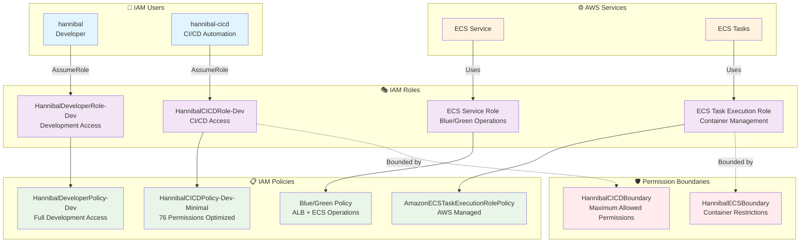

# IAM権限構成

## 🔐 IAM アーキテクチャ



## 🏗️ 設計原則

### 基盤とアプリケーションの分離
- **基盤IAMリソース**: 手動管理・永続保持
- **アプリケーションIAMリソース**: Terraform管理・一時的

### 最小権限の原則
- **CloudTrail分析**: 実際の使用権限（76個）を特定
- **Permission Boundary**: 最大権限の制限
- **段階的権限縮小**: 160個 → 76個（52%削減）

### 環境分離
- **開発環境**: HannibalDeveloperRole-Dev
- **CI/CD環境**: HannibalCICDRole-Dev
- **本番環境**: 将来的に別アカウント分離

## 📊 権限最適化結果

### CI/CD権限分析 2025年7月27日
- **分析前**: 160個の権限
- **実際使用**: 76個の権限
- **削減率**: 52%の権限削減達成

### 企業レベル監査
- **CloudTrail**: 全API呼び出しを記録
- **Athena分析**: 権限使用パターンの可視化
- **継続的最適化**: 定期的な権限見直し

## 🔒 セキュリティ機能

### Permission Boundary
```json
{
  "Version": "2012-10-17",
  "Statement": [
    {
      "Effect": "Deny",
      "Action": [
        "iam:CreateUser",
        "iam:DeleteUser",
        "organizations:*"
      ],
      "Resource": "*"
    }
  ]
}
```

### AssumeRole設定
```json
{
  "Version": "2012-10-17",
  "Statement": [
    {
      "Effect": "Allow",
      "Principal": {
        "AWS": "arn:aws:iam::258632448142:user/hannibal-cicd"
      },
      "Action": "sts:AssumeRole",
      "Condition": {
        "StringEquals": {
          "sts:ExternalId": "unique-external-id"
        }
      }
    }
  ]
}
```