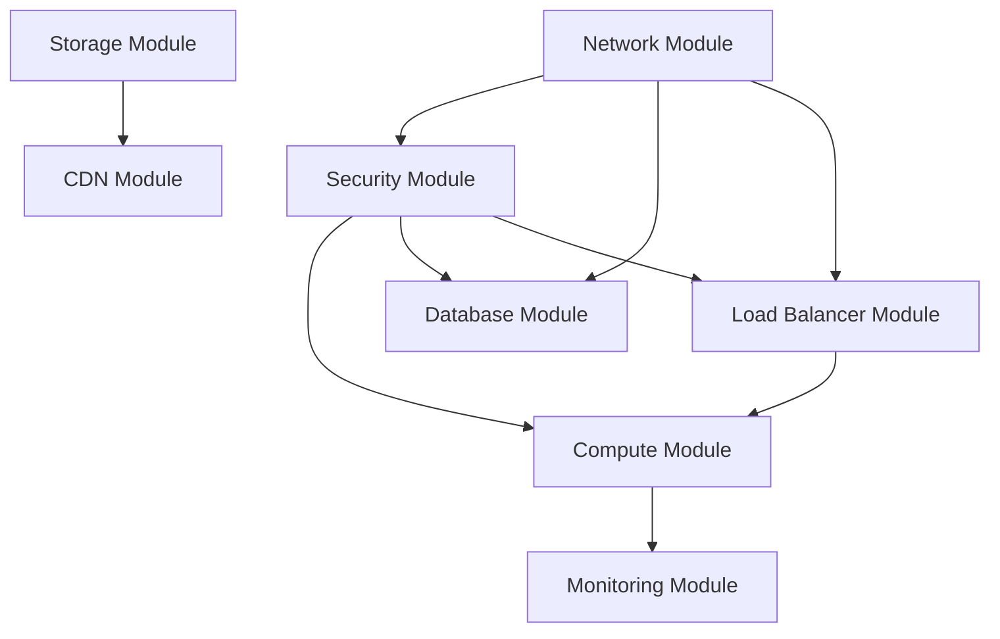

# Terraform Modules Design - NestJS Hannibal 3

## モジュール化戦略
89,711行のTerraformコードを再利用可能なモジュールに分割

## 現在の課題
- **単一ファイル**: 巨大なmain.tfファイル
- **重複コード**: 環境間での設定重複
- **保守性**: 変更影響範囲の把握困難
- **再利用性**: 他プロジェクトでの活用不可

## モジュール設計

### 1. ネットワークモジュール
```hcl
# modules/network/main.tf
module "vpc" {
  source = "./modules/network"
  
  project_name = var.project_name
  environment  = var.environment
  vpc_cidr     = "10.0.0.0/16"
  
  availability_zones = ["ap-northeast-1a", "ap-northeast-1c"]
  
  public_subnets  = ["10.0.1.0/24", "10.0.2.0/24"]
  private_subnets = ["10.0.11.0/24", "10.0.12.0/24"]
  data_subnets    = ["10.0.21.0/24", "10.0.22.0/24"]
}
```

### 2. セキュリティモジュール
```hcl
# modules/security/main.tf
module "security_groups" {
  source = "./modules/security"
  
  vpc_id       = module.vpc.vpc_id
  project_name = var.project_name
  
  alb_ingress_ports = [80, 443, 8080]
  ecs_port         = 3000
  rds_port         = 5432
}
```

### 3. コンピュートモジュール
```hcl
# modules/compute/main.tf
module "ecs_cluster" {
  source = "./modules/compute"
  
  project_name = var.project_name
  environment  = var.environment
  
  vpc_id             = module.vpc.vpc_id
  private_subnet_ids = module.vpc.private_subnet_ids
  security_group_id  = module.security.ecs_security_group_id
  
  container_image = var.container_image
  container_port  = 3000
  
  # Blue/Green設定
  enable_blue_green = true
  target_group_arns = module.load_balancer.target_group_arns
}
```

### 4. データベースモジュール
```hcl
# modules/database/main.tf
module "rds" {
  source = "./modules/database"
  
  project_name = var.project_name
  environment  = var.environment
  
  vpc_id            = module.vpc.vpc_id
  data_subnet_ids   = module.vpc.data_subnet_ids
  security_group_id = module.security.rds_security_group_id
  
  engine_version = "15.4"
  instance_class = var.rds_instance_class
  
  multi_az               = var.environment == "prod"
  backup_retention_days  = var.environment == "prod" ? 30 : 7
  deletion_protection    = var.environment == "prod"
}
```

### 5. ロードバランサーモジュール
```hcl
# modules/load_balancer/main.tf
module "alb" {
  source = "./modules/load_balancer"
  
  project_name = var.project_name
  environment  = var.environment
  
  vpc_id            = module.vpc.vpc_id
  public_subnet_ids = module.vpc.public_subnet_ids
  security_group_id = module.security.alb_security_group_id
  
  # Blue/Green設定
  enable_blue_green = true
  health_check_path = "/health"
  
  # SSL証明書
  certificate_arn = var.ssl_certificate_arn
}
```

### 6. CDNモジュール
```hcl
# modules/cdn/main.tf
module "cloudfront" {
  source = "./modules/cdn"
  
  project_name = var.project_name
  environment  = var.environment
  
  s3_bucket_domain = module.storage.s3_bucket_domain
  alb_domain       = module.load_balancer.alb_dns_name
  
  # キャッシュ設定
  default_ttl = 86400
  max_ttl     = 31536000
  
  # WAF設定 (将来実装)
  enable_waf = var.environment == "prod"
}
```

### 7. ストレージモジュール
```hcl
# modules/storage/main.tf
module "s3" {
  source = "./modules/storage"
  
  project_name = var.project_name
  environment  = var.environment
  
  # 静的ファイル用バケット
  enable_static_hosting = true
  enable_versioning     = true
  
  # ログ用バケット
  enable_access_logging = true
  log_retention_days    = var.environment == "prod" ? 2555 : 90
}
```

## 環境別設定

### 開発環境 (dev)
```hcl
# environments/dev/terraform.tfvars
project_name = "nestjs-hannibal-3"
environment  = "dev"

# コスト最適化
rds_instance_class = "db.t3.micro"
ecs_cpu           = 256
ecs_memory        = 512
enable_multi_az   = false
```

### 本番環境 (prod)
```hcl
# environments/prod/terraform.tfvars
project_name = "nestjs-hannibal-3"
environment  = "prod"

# 高可用性・パフォーマンス
rds_instance_class = "db.r5.large"
ecs_cpu           = 1024
ecs_memory        = 2048
enable_multi_az   = true
```

## モジュール間依存関係



## 実装計画

### Phase 1: 基盤モジュール (Week 1-2)
1. **Network Module**: VPC, Subnets, Route Tables
2. **Security Module**: Security Groups, NACLs
3. **Storage Module**: S3 Buckets

### Phase 2: アプリケーションモジュール (Week 3-4)
1. **Database Module**: RDS, Subnet Groups
2. **Load Balancer Module**: ALB, Target Groups
3. **Compute Module**: ECS, Task Definitions

### Phase 3: 配信・監視モジュール (Week 5-6)
1. **CDN Module**: CloudFront, OAC
2. **Monitoring Module**: CloudWatch, Alarms
3. **IAM Module**: Roles, Policies

## 品質保証

### モジュールテスト
```hcl
# tests/network_test.go
func TestNetworkModule(t *testing.T) {
    terraformOptions := &terraform.Options{
        TerraformDir: "../modules/network",
        Vars: map[string]interface{}{
            "project_name": "test-hannibal",
            "vpc_cidr":     "10.0.0.0/16",
        },
    }
    
    defer terraform.Destroy(t, terraformOptions)
    terraform.InitAndApply(t, terraformOptions)
    
    vpcId := terraform.Output(t, terraformOptions, "vpc_id")
    assert.NotEmpty(t, vpcId)
}
```

### バリデーション
```hcl
# modules/network/variables.tf
variable "vpc_cidr" {
  description = "VPC CIDR block"
  type        = string
  
  validation {
    condition = can(cidrhost(var.vpc_cidr, 0))
    error_message = "VPC CIDR must be a valid IPv4 CIDR block."
  }
}
```

## ドキュメント自動生成

### terraform-docs設定
```yaml
# .terraform-docs.yml
formatter: "markdown table"
header-from: main.tf
footer-from: ""
recursive:
  enabled: true
  path: modules
sections:
  hide:
    - header
  show:
    - inputs
    - outputs
    - providers
    - requirements
```

### 生成コマンド
```bash
# 全モジュールのドキュメント生成
terraform-docs markdown table --output-file README.md --recursive modules/

# 特定モジュールのドキュメント生成
terraform-docs markdown table modules/network/ > modules/network/README.md
```

## 運用・保守

### バージョン管理
```hcl
# モジュールバージョン指定
module "network" {
  source = "git::https://github.com/kmryst/terraform-hannibal-modules.git//network?ref=v1.0.0"
  
  project_name = var.project_name
  environment  = var.environment
}
```

### 更新戦略
1. **セマンティックバージョニング**: v1.0.0, v1.1.0, v2.0.0
2. **後方互換性**: 破壊的変更の最小化
3. **段階的更新**: dev → staging → prod

## 期待効果

### 開発効率向上
- **コード削減**: 89,711行 → 約30,000行 (66%削減)
- **開発時間**: 新環境構築 8時間 → 2時間
- **保守性**: 変更影響範囲の明確化

### 品質向上
- **再利用性**: 他プロジェクトでの活用
- **テスト容易性**: モジュール単位テスト
- **標準化**: 企業内Terraformベストプラクティス

---
**更新日**: 2025年1月8日  
**対象コード**: 89,711行 HCL → モジュール化