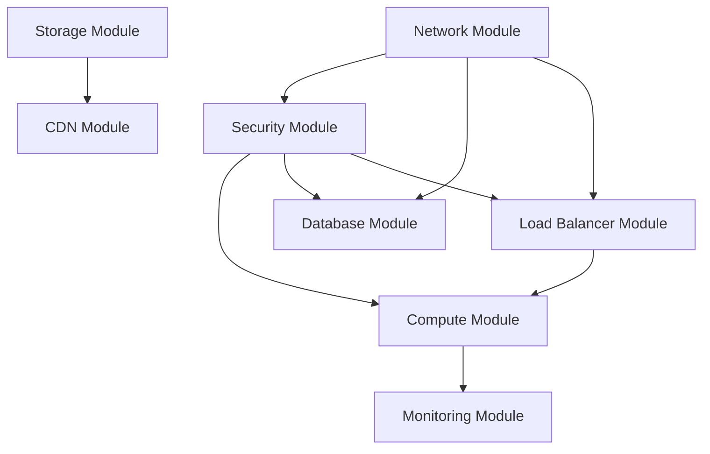

# Terraform Modules 実装状況 - NestJS Hannibal 3

## モジュール化完了

Terraformコードを**7カテゴリ・11モジュール**に分割し、再利用可能な構成を実現。

## 実装済みモジュール構成

```
terraform/
├── foundation/              # 基盤リソース（永続管理）
│   ├── iam.tf              # IAM User/Role (AssumeRole + Permission Boundary)
│   ├── billing.tf          # コスト監視 ($30-50 → 停止時$5)
│   ├── athena.tf           # CloudTrail分析
│   └── s3-backend.tf       # Terraform State管理 (S3 + DynamoDB Lock)
├── modules/                # 再利用可能モジュール
│   ├── networking/
│   │   ├── vpc/            # 3層VPC (Public/App/Data)
│   │   └── dns/            # Route53 (hamilcar-hannibal.click)
│   ├── compute/
│   │   ├── ecs/            # ECS Fargate (0.25vCPU / 0.5GB)
│   │   └── load-balancer/  # ALB (Blue/Green対応)
│   ├── cicd/
│   │   └── codedeploy/     # CodeDeploy (Blue/Green + Canary)
│   ├── storage/
│   │   ├── rds/            # PostgreSQL 15 (t4g.micro)
│   │   └── s3/             # Static Assets + Artifacts
│   ├── cdn/
│   │   └── cloudfront/     # CloudFront (グローバルCDN)
│   ├── security/
│   │   ├── iam/            # IAM Roles/Policies
│   │   └── security-groups/ # Security Groups
│   └── observability/
│       └── monitoring/      # CloudWatch (Logs + Metrics)
└── environments/
    └── dev/                # 環境別設定
        └── main.tf         # モジュール統合
```

## 実装済みモジュール詳細

### 1. ネットワークモジュール（networking/vpc）
**実装状況**: ✅ 完了

```hcl
# 3層VPCアーキテクチャ
module "vpc" {
  source = "../../modules/networking/vpc"
  
  project_name = var.project_name
  environment  = var.environment
  vpc_cidr     = "10.0.0.0/16"
  
  availability_zones = ["ap-northeast-1a", "ap-northeast-1c"]
  
  # Public Subnet: ALB配置
  public_subnets  = ["10.0.1.0/24", "10.0.2.0/24"]
  
  # App Subnet: ECS Fargate配置（NAT Gateway経由でインターネットアクセス）
  private_subnets = ["10.0.11.0/24", "10.0.12.0/24"]
  
  # Data Subnet: RDS配置（完全非公開）
  data_subnets    = ["10.0.21.0/24", "10.0.22.0/24"]
}
```

**特徴:**
- DB層は完全非公開（Public IPなし、インターネットアクセスなし）
- NAT Gateway経由でECSからのアウトバウンド通信を実現
- Route53でドメイン管理（hamilcar-hannibal.click）

### 2. セキュリティモジュール（security/security-groups）
**実装状況**: ✅ 完了

```hcl
module "security_groups" {
  source = "../../modules/security/security-groups"
  
  vpc_id       = module.vpc.vpc_id
  project_name = var.project_name
  
  # ALB: HTTP/HTTPS + Test Listener (8080)
  alb_ingress_ports = [80, 443, 8080]
  
  # ECS: アプリケーションポート
  ecs_port = 3000
  
  # RDS: PostgreSQL
  rds_port = 5432
}
```

**特徴:**
- 最小権限の原則に基づくセキュリティグループ設定
- ALB → ECS → RDS の通信経路のみ許可
- IAMモジュール（security/iam）でPermission Boundary実装

### 3. コンピュートモジュール（compute/ecs + load-balancer）
**実装状況**: ✅ 完了

```hcl
# ECS Fargate
module "ecs" {
  source = "../../modules/compute/ecs"
  
  project_name = var.project_name
  environment  = var.environment
  
  vpc_id             = module.vpc.vpc_id
  private_subnet_ids = module.vpc.private_subnet_ids
  security_group_id  = module.security.ecs_security_group_id
  
  # コスト最適化構成
  cpu    = 256   # 0.25vCPU
  memory = 512   # 0.5GB
  
  container_image = "${var.ecr_repository_url}:latest"
  container_port  = 3000
}

# ALB (Blue/Green対応)
module "load_balancer" {
  source = "../../modules/compute/load-balancer"
  
  # Blue/Green Deployment用のTarget Group設定
  enable_blue_green = true
  health_check_path = "/health"
}
```

**特徴:**
- Multi-stage Dockerビルド（node:20-alpine）
- Blue/Green Deployment対応のTarget Group構成
- Health Check: 5回成功で正常判定

### 4. ストレージモジュール（storage/rds + s3）
**実装状況**: ✅ 完了

```hcl
# RDS PostgreSQL
module "rds" {
  source = "../../modules/storage/rds"
  
  project_name = var.project_name
  environment  = var.environment
  
  vpc_id            = module.vpc.vpc_id
  data_subnet_ids   = module.vpc.data_subnet_ids
  security_group_id = module.security.rds_security_group_id
  
  # PostgreSQL 15
  engine_version = "15"
  
  # コスト最適化構成（dev環境）
  instance_class = "db.t4g.micro"
  allocated_storage = 20
  
  # Single-AZ（コスト重視）
  multi_az = false
  
  # バックアップ（開発環境は7日）
  backup_retention_days = 7
  
  # 削除保護なし（開発環境）
  deletion_protection = false
}

# S3 (Static Assets + CodeDeploy Artifacts)
module "s3" {
  source = "../../modules/storage/s3"
  
  project_name = var.project_name
  
  # CodeDeploy Artifacts用バケット
  enable_versioning = true
  
  # 暗号化
  sse_algorithm = "AES256"
}
```

**特徴:**
- RDSは完全非公開（Private Subnet、Public IPなし）
- Secrets Managerでデータベース認証情報を管理
- S3はCodeDeploy Artifactsとして使用

### 5. CI/CDモジュール（cicd/codedeploy）
**実装状況**: ✅ 完了

```hcl
module "codedeploy" {
  source = "../../modules/cicd/codedeploy"
  
  project_name = var.project_name
  environment  = var.environment
  
  # ECS Service情報
  ecs_cluster_name = module.ecs.cluster_name
  ecs_service_name = module.ecs.service_name
  
  # ALB Target Groups (Blue/Green)
  blue_target_group_name  = module.load_balancer.blue_target_group_name
  green_target_group_name = module.load_balancer.green_target_group_name
  
  # ALB Listeners
  prod_listener_arn = module.load_balancer.http_listener_arn
  test_listener_arn = module.load_balancer.test_listener_arn
  
  # デプロイ設定
  deployment_config_name = "CodeDeployDefault.ECSCanary10Percent5Minutes"
  
  # 自動ロールバック
  auto_rollback_enabled = true
}
```

**特徴:**
- Blue/Green Deployment: 約5分で無停止切替
- Canary Deployment: 10% → 100% 段階的配信
- 自動ロールバック: ヘルスチェック失敗時

### 6. CDNモジュール（cdn/cloudfront）
**実装状況**: ✅ 完了

```hcl
module "cloudfront" {
  source = "../../modules/cdn/cloudfront"
  
  project_name = var.project_name
  environment  = var.environment
  
  # Origin設定
  s3_bucket_domain = module.s3.bucket_domain
  alb_domain       = module.load_balancer.alb_dns_name
  
  # キャッシュ設定
  default_ttl = 86400    # 1日
  max_ttl     = 31536000 # 1年
  
  # カスタムドメイン
  aliases = ["hamilcar-hannibal.click"]
}
```

**特徴:**
- グローバルCDN配信
- Route53統合（hamilcar-hannibal.click）
- WAFは予算制約で無効化（将来実装予定）

### 7. 監視モジュール（observability/monitoring）
**実装状況**: ✅ 完了

```hcl
module "monitoring" {
  source = "../../modules/observability/monitoring"
  
  project_name = var.project_name
  
  # CloudWatch Logs
  ecs_log_group_name = "/ecs/${var.project_name}"
  log_retention_days = 7
  
  # CloudWatch Metrics
  enable_ecs_metrics = true
  enable_rds_metrics = true
  enable_alb_metrics = true
}
```

**特徴:**
- ECS/RDS/ALBの統合監視
- CloudTrail: 全API呼び出しを90日保持
- Athena: CloudTrail分析基盤

## 環境別設定

### 開発環境 (dev)
```hcl
# environments/dev/terraform.tfvars
project_name = "nestjs-hannibal-3"
environment  = "dev"

# コスト最適化
rds_instance_class = "db.t3.micro"
ecs_cpu           = 256
ecs_memory        = 512
enable_multi_az   = false
```

### 本番環境 (prod)
```hcl
# environments/prod/terraform.tfvars
project_name = "nestjs-hannibal-3"
environment  = "prod"

# 高可用性・パフォーマンス
rds_instance_class = "db.r5.large"
ecs_cpu           = 1024
ecs_memory        = 2048
enable_multi_az   = true
```

## モジュール間依存関係



## 実装完了状況

### ✅ 全モジュール実装完了（2025年10月時点）

| モジュールカテゴリ | モジュール | 状態 | 備考 |
|-------------------|-----------|------|------|
| **networking** | vpc | ✅ | 3層VPC (Public/App/Data) |
| | dns | ✅ | Route53 (hamilcar-hannibal.click) |
| **compute** | ecs | ✅ | Fargate 0.25vCPU / 0.5GB |
| | load-balancer | ✅ | ALB (Blue/Green対応) |
| **cicd** | codedeploy | ✅ | Blue/Green + Canary |
| **storage** | rds | ✅ | PostgreSQL 15 (t4g.micro) |
| | s3 | ✅ | Static Assets + Artifacts |
| **cdn** | cloudfront | ✅ | グローバルCDN |
| **security** | iam | ✅ | Permission Boundary |
| | security-groups | ✅ | 最小権限設定 |
| **observability** | monitoring | ✅ | CloudWatch統合監視 |

### 実装成果

1. **コスト最適化**: 月額 $30-50 → 停止時 $5（94%削減）
2. **デプロイ時間**: 初期構築 約15分、Blue/Green 約5分
3. **セキュリティ**: 4層防御（SAST/SCA/IaC/Secrets）
4. **可用性**: Multi-AZ対応可能（現在はコスト重視でSingle-AZ）

## 品質保証

### モジュールテスト
```hcl
# tests/network_test.go
func TestNetworkModule(t *testing.T) {
    terraformOptions := &terraform.Options{
        TerraformDir: "../modules/network",
        Vars: map[string]interface{}{
            "project_name": "test-hannibal",
            "vpc_cidr":     "10.0.0.0/16",
        },
    }
    
    defer terraform.Destroy(t, terraformOptions)
    terraform.InitAndApply(t, terraformOptions)
    
    vpcId := terraform.Output(t, terraformOptions, "vpc_id")
    assert.NotEmpty(t, vpcId)
}
```

### バリデーション
```hcl
# modules/network/variables.tf
variable "vpc_cidr" {
  description = "VPC CIDR block"
  type        = string
  
  validation {
    condition = can(cidrhost(var.vpc_cidr, 0))
    error_message = "VPC CIDR must be a valid IPv4 CIDR block."
  }
}
```

## ドキュメント自動生成

### terraform-docs設定
```yaml
# .terraform-docs.yml
formatter: "markdown table"
header-from: main.tf
footer-from: ""
recursive:
  enabled: true
  path: modules
sections:
  hide:
    - header
  show:
    - inputs
    - outputs
    - providers
    - requirements
```

### 生成コマンド
```bash
# 全モジュールのドキュメント生成
terraform-docs markdown table --output-file README.md --recursive modules/

# 特定モジュールのドキュメント生成
terraform-docs markdown table modules/network/ > modules/network/README.md
```

## 運用・保守

### バージョン管理
```hcl
# モジュールバージョン指定
module "network" {
  source = "git::https://github.com/kmryst/terraform-hannibal-modules.git//network?ref=v1.0.0"
  
  project_name = var.project_name
  environment  = var.environment
}
```

### 更新戦略
1. **セマンティックバージョニング**: v1.0.0, v1.1.0, v2.0.0
2. **後方互換性**: 破壊的変更の最小化
3. **段階的更新**: dev → staging → prod

## 実装済みモジュールの再利用方法

### 環境別設定例

#### 開発環境 (environments/dev)
```hcl
# コスト最適化構成
module "compute" {
  source = "../../modules/compute/ecs"
  
  cpu    = 256  # 0.25vCPU
  memory = 512  # 0.5GB
}

module "storage" {
  source = "../../modules/storage/rds"
  
  instance_class = "db.t4g.micro"
  multi_az       = false  # Single-AZ
}
```

#### 本番環境（将来実装）
```hcl
# 高可用性・パフォーマンス構成
module "compute" {
  source = "../../modules/compute/ecs"
  
  cpu    = 1024  # 1.0vCPU
  memory = 2048  # 2.0GB
}

module "storage" {
  source = "../../modules/storage/rds"
  
  instance_class = "db.t4g.small"
  multi_az       = true  # Multi-AZ
}
```

## 達成効果

### 開発効率向上
- **モジュール化完了**: 7カテゴリ・11モジュールに分割
- **再利用性**: 環境間で設定を共有
- **保守性**: 変更影響範囲の明確化

### 品質向上
- **Infrastructure as Code**: 全リソースをコード管理
- **State管理**: S3 + DynamoDB Lock
- **セキュリティ**: tfsecによる自動検証

### コスト最適化
- **停止運用**: 月額 $30-50 → $5（94%削減）
- **起動/停止自動化**: GitHub Actions (約15分)

---
**最終更新**: 2025年10月12日  
**実装状況**: 全モジュール完了