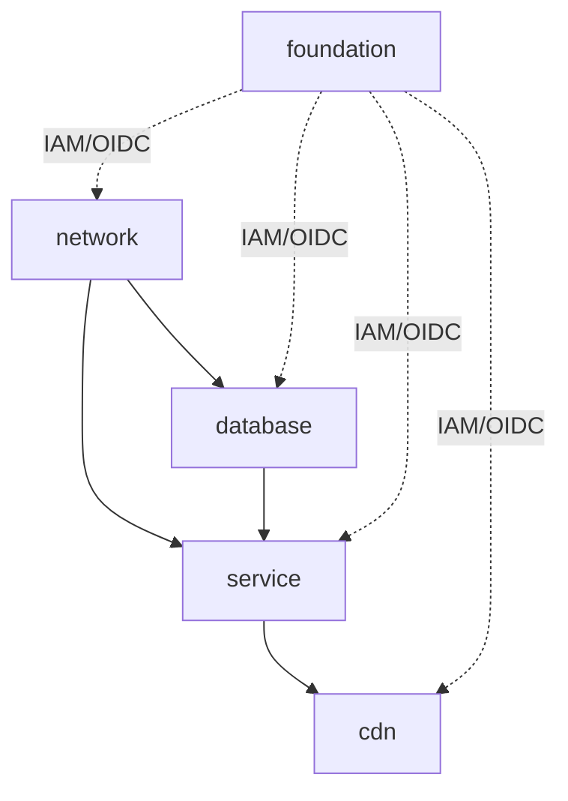

# Terraform Modules 実装状況

このドキュメントは、state 分割後の現行 Terraform 構成に基づくモジュール実装状況をまとめます。
環境 root module の全体像は [terraform-environments.md](../terraform-environments.md) も参照してください。

## 現行構成

Terraform は、責務ごとの root module と再利用可能な local module に分かれています。

```text
terraform/
├── foundation/          # 基盤 IAM / OIDC / CloudTrail / billing などの永続リソース
├── network/             # VPC、subnet、Security Group
├── database/            # RDS PostgreSQL
├── service/             # ALB、ECS、CodeDeploy、CloudWatch monitoring
├── cdn/                 # S3、CloudFront、Route53 DNS
└── modules/             # root module から参照する local module
    ├── cloudfront/
    ├── codedeploy/
    ├── dns/
    ├── ecs/
    ├── load-balancer/
    ├── monitoring/
    ├── rds/
    ├── s3/
    └── vpc/
```

`network` / `database` / `service` / `cdn` は state を分割して管理します。
`database`、`service`、`cdn` は `terraform_remote_state` で前段の outputs を参照します。


```mermaid
graph TD
    Foundation[foundation]
    Network[network]
    Database[database]
    Service[service]
    Cdn[cdn]

    Network --> Database
    Network --> Service
    Database --> Service
    Service --> Cdn
    Foundation -. IAM/OIDC .-> Network
    Foundation -. IAM/OIDC .-> Database
    Foundation -. IAM/OIDC .-> Service
    Foundation -. IAM/OIDC .-> Cdn
```

## 実装済みモジュール

| root module          | local module                      | 主な責務                                                             |
| -------------------- | --------------------------------- | -------------------------------------------------------------------- |
| `terraform/network`  | `terraform/modules/vpc`           | VPC、public/app/data subnet、NAT Gateway、ALB/ECS/RDS Security Group |
| `terraform/database` | `terraform/modules/rds`           | RDS PostgreSQL、Subnet Group、RDS managed master user secret         |
| `terraform/service`  | `terraform/modules/load-balancer` | ALB、production/test listener、blue/green target group               |
| `terraform/service`  | `terraform/modules/ecs`           | ECS cluster/service/task definition、task execution role             |
| `terraform/service`  | `terraform/modules/monitoring`    | CloudWatch alarm / SNS topic                                         |
| `terraform/service`  | `terraform/modules/codedeploy`    | ECS Blue/Green / Canary deployment group                             |
| `terraform/cdn`      | `terraform/modules/s3`            | frontend static asset bucket and bucket policy                       |
| `terraform/cdn`      | `terraform/modules/cloudfront`    | CloudFront distribution and origin settings                          |
| `terraform/cdn`      | `terraform/modules/dns`           | Route53 alias records                                                |

`security-groups` は独立した local module ではなく、現在は `terraform/modules/vpc/security_groups.tf` として VPC module に含めています。

## モジュール利用例

### vpc

`terraform/network` から `terraform/modules/vpc` を呼び出します。

```hcl
module "vpc" {
  source = "../modules/vpc"

  project_name                            = var.project_name
  environment                             = var.environment
  container_port                          = var.container_port
  cloudfront_origin_facing_prefix_list_id = var.cloudfront_origin_facing_prefix_list_id
}
```

`vpc` module は VPC と subnet に加えて、ALB / ECS / RDS 用 Security Group も作成します。
Security Group の standalone module は現行構成にはありません。

### security-groups

Security Group は `terraform/modules/vpc/security_groups.tf` として `vpc` module に含まれます。
そのため、現行構成では `module "security_groups"` の呼び出しはありません。
Security Group に関係する入力も `vpc` module の変数として渡します。

```hcl
module "vpc" {
  source = "../modules/vpc"

  project_name                            = var.project_name
  environment                             = var.environment
  container_port                          = var.container_port
  cloudfront_origin_facing_prefix_list_id = var.cloudfront_origin_facing_prefix_list_id
}
```

### rds

`terraform/database` は network state の outputs を参照して RDS を作成します。

```hcl
module "rds" {
  source = "../modules/rds"

  project_name                = var.project_name
  environment                 = var.environment
  db_instance_class           = var.db_instance_class
  db_allocated_storage        = var.db_allocated_storage
  db_engine_version           = var.db_engine_version
  db_name                     = var.db_name
  db_username                 = var.db_username
  db_password                 = var.db_password
  manage_master_user_password = var.manage_master_user_password
  data_subnet_ids             = data.terraform_remote_state.network.outputs.data_subnet_ids
  rds_security_group_id       = data.terraform_remote_state.network.outputs.rds_security_group_id
}
```

`db_instance_class` の既定値は `db.t3.micro`、`db_engine_version` の既定値は `15.14` です。

### load-balancer

`terraform/service` は network state の outputs を使って ALB を作成します。

```hcl
module "load_balancer" {
  source = "../modules/load-balancer"

  project_name                   = var.project_name
  environment                    = var.environment
  vpc_id                         = data.terraform_remote_state.network.outputs.vpc_id
  alb_security_group_id          = data.terraform_remote_state.network.outputs.alb_security_group_id
  public_subnet_ids              = data.terraform_remote_state.network.outputs.public_subnet_ids
  container_port                 = var.container_port
  health_check_path              = var.health_check_path
  alb_certificate_arn            = var.alb_certificate_arn
  alb_origin_verify_header_name  = local.alb_origin_verify_header_name
  alb_origin_verify_header_value = random_password.alb_origin_verify_header.result
}
```

### ecs

ECS は database state と network state の outputs、ALB module の outputs を参照します。

```hcl
module "ecs" {
  source = "../modules/ecs"

  project_name                = var.project_name
  aws_region                  = var.aws_region
  ecr_repository_url          = var.ecr_repository_url
  container_port              = var.container_port
  desired_task_count          = var.desired_task_count
  cpu                         = var.cpu
  memory                      = var.memory
  client_url_for_cors         = var.client_url_for_cors
  db_name                     = var.db_name
  db_credentials_secret_arn   = data.terraform_remote_state.database.outputs.master_user_secret_arn
  app_subnet_ids              = data.terraform_remote_state.network.outputs.app_subnet_ids
  ecs_security_group_id       = data.terraform_remote_state.network.outputs.ecs_security_group_id
  blue_target_group_arn       = module.load_balancer.blue_target_group_arn
  alb_listener_production_arn = module.load_balancer.https_listener_arn
  alb_listener_test_arn       = module.load_balancer.test_listener_arn
  rds_endpoint                = data.terraform_remote_state.database.outputs.db_instance_endpoint
}
```

既定の Fargate task size は `cpu = 256`、`memory = 512` です。

### monitoring

Monitoring は ECS、RDS、ALB の識別子を受け取り、アラームと通知先を作成します。

```hcl
module "monitoring" {
  source = "../modules/monitoring"

  project_name     = var.project_name
  aws_region       = var.aws_region
  alert_email      = var.alert_email
  ecs_service_name = module.ecs.service_name
  ecs_cluster_name = module.ecs.cluster_name
  rds_instance_id  = data.terraform_remote_state.database.outputs.db_instance_id
  alb_arn_suffix   = module.load_balancer.alb_arn
}
```

### codedeploy

CodeDeploy は ALB、ECS、monitoring の outputs を使って deployment group を作成します。

```hcl
module "codedeploy" {
  source = "../modules/codedeploy"

  project_name                    = var.project_name
  environment                     = var.environment
  deployment_type                 = var.deployment_type
  blue_target_group_name          = module.load_balancer.blue_target_group_name
  green_target_group_name         = module.load_balancer.green_target_group_name
  ecs_cluster_name                = module.ecs.cluster_name
  ecs_service_name                = module.ecs.service_name
  alb_listener_production_arn     = module.load_balancer.https_listener_arn
  alb_listener_test_arn           = module.load_balancer.test_listener_arn
  canary_error_rate_alarm_name    = module.monitoring.canary_error_rate_alarm_name
  canary_response_time_alarm_name = module.monitoring.canary_response_time_alarm_name
}
```

`deployment_type` は `canary` / `bluegreen` を指定します。

### s3

`terraform/cdn` で frontend static asset 用 bucket を作成します。

```hcl
module "s3" {
  source = "../modules/s3"

  s3_bucket_name              = var.s3_bucket_name
  frontend_build_path         = var.frontend_build_path
  cloudfront_distribution_arn = var.enable_cloudfront ? module.cloudfront.distribution_arn : null
}
```

`frontend_build_path` の既定値は `../../../client/dist` です。

### cloudfront

CloudFront は S3 module の outputs と service state の ALB origin verification header を参照します。

```hcl
module "cloudfront" {
  source = "../modules/cloudfront"

  project_name                   = var.project_name
  enable_cloudfront              = var.enable_cloudfront
  domain_name                    = var.domain_name
  s3_bucket_name                 = var.s3_bucket_name
  s3_bucket_regional_domain_name = module.s3.bucket_regional_domain_name
  api_origin_domain_name         = "api.${var.domain_name}"
  acm_certificate_arn_us_east_1  = var.acm_certificate_arn_us_east_1
  cloudfront_oac_id              = var.cloudfront_oac_id
  alb_origin_verify_header_name  = "X-Hannibal-Origin-Verify"
  alb_origin_verify_header_value = data.terraform_remote_state.service.outputs.alb_origin_verify_header_value
}
```

`enable_cloudfront = false` にすると、dev で CloudFront distribution 作成を省略できます。

## 環境別設定

現行構成では旧 `environments` 配下の環境別 tfvars は使いません。
設定値は責務ごとの root module に渡します。

```hcl
# terraform/database の例
project_name                = "nestjs-hannibal-3"
environment                 = "dev"
db_instance_class           = "db.t3.micro"
db_allocated_storage        = 20
db_engine_version           = "15.14"
db_name                     = "hannibal"
db_username                 = "postgres"
manage_master_user_password = true
```

```hcl
# terraform/service の例
project_name       = "nestjs-hannibal-3"
environment        = "dev"
aws_region         = "ap-northeast-1"
container_port     = 3000
desired_task_count = 1
cpu                = 256
memory             = 512
deployment_type    = "canary"
```

## 可用性とコスト方針

dev は停止運用とコスト最適化を優先し、RDS は `db.t3.micro` / Single-AZ を前提にします。
prod 相当へ拡張する場合は、実メトリクスに基づいて ECS task size、RDS instance class、RDS Multi-AZ などを再検討します。
RDS instance class の引き上げ判断は [ADR 0022](../adr/0022-keep-prod-rds-on-t3-micro-until-metrics-justify-scale-up.md) の条件に従います。

## 品質保証

Terraform 変更時は、PR で次の静的検証を実行します。

```bash
terraform fmt -check -recursive

for dir in terraform/foundation terraform/network terraform/database terraform/service terraform/cdn; do
  terraform -chdir="$dir" init -backend=false
  terraform -chdir="$dir" validate
done
```

PR workflow では Terraform Format & Validate、TFLint、Trivy Config Scan、Gitleaks Secret Scan を使って IaC の品質と secret 混入を確認します。

## 運用

- state は root module ごとに分割して管理します。
- `terraform/foundation` の恒久リソースは state に残して継続管理します。
- `terraform/network`、`terraform/database`、`terraform/service`、`terraform/cdn` は deploy / destroy workflow から自動管理します。
- local module はこの repository 内の `terraform/modules/*` を参照します。
- 外部 repository の module 参照や terraform-docs 設定ファイルによる自動生成運用は、現行構成では採用していません。

---

**最終更新**: 2026年6月24日
**実装状況**: state 分割後の現行構成を反映
