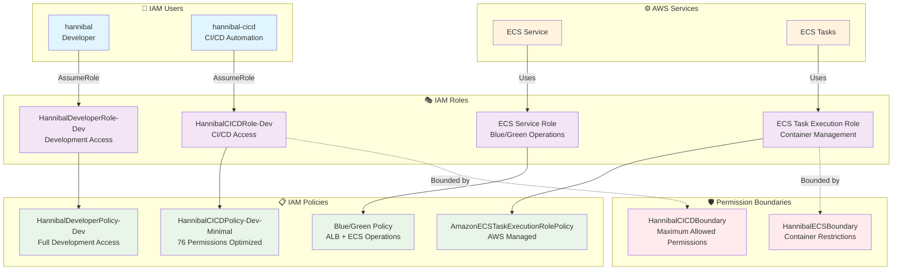

# IAM権限管理

## 🔐 IAM アーキテクチャ



## 🔐 IAM構成 (AWS Professional設計)

### **基盤IAMリソース**
```
👤 hannibal (IAMユーザー・メイン開発者)
├── インラインポリシー: AssumeDevRole
└── 使用可能ロール: HannibalDeveloperRole-Dev
   └── アタッチポリシー: HannibalDeveloperPolicy-Dev（ECR/ECS/RDS/CloudWatch/EC2/ELB/S3/CloudFront/IAM）

🤖 hannibal-cicd (IAMユーザー・CI/CD自動化)
├── インラインポリシー: AssumeCICDRole
└── 使用可能ロール: HannibalCICDRole-Dev
   ├── Permission Boundary: HannibalCICDBoundary
   ├── アタッチポリシー: HannibalCICDPolicy-Dev-Minimal（CloudTrail分析に基づく最小権限）
   └── 保持ポリシー: HannibalCICDPolicy-Dev（広い権限・未アタッチ）
```

### **アプリケーションIAMリソース（一時的・Terraform管理）**
```
🔧 ecs-tasks.amazonaws.com (ECSサービス)
└── 使用ロール: nestjs-hannibal-3-ecs-task-execution-role（Terraform管理）
   ├── Permission Boundary: HannibalECSBoundary（現在永続化・検討の余地あり）
   └── アタッチポリシー: AmazonECSTaskExecutionRolePolicy（AWS管理ポリシー・Terraformでアタッチ）
```

### **運用フロー**
```bash
# 日常開発 (hannibal)
aws sts assume-role --role-arn arn:aws:iam::258632448142:role/HannibalDeveloperRole-Dev --role-session-name dev-session

# 自動デプロイ (GitHub Actions)
# hannibal-cicdの認証情報でHannibalCICDRole-DevをAssume
```

### **管理方針**
- **IAMユーザー**: 完全手動管理
- **IAMロール・ポリシー**: Terraform作成後、管理から除外・永続保持
- **段階的権限縮小**: CloudTrailログ分析後に最小権限化完了

## 🏗️ 設計原則

### 基盤とアプリケーションの分離
- **基盤IAMリソース**: 手動管理・永続保持
- **アプリケーションIAMリソース**: Terraform管理・一時的

### 最小権限の原則
- **CloudTrail分析**: 実際の使用権限（76個）を特定
- **Permission Boundary**: 最大権限の制限
- **段階的権限縮小**: 160個 → 76個（52%削減）

### 環境分離
- **開発環境**: HannibalDeveloperRole-Dev
- **CI/CD環境**: HannibalCICDRole-Dev
- **本番環境**: 将来的に別アカウント分離

## 📊 権限最適化結果

### CI/CD権限分析 2025年7月27日
- **分析前**: 160個の権限
- **実際使用**: 76個の権限
- **削減率**: 52%の権限削減達成

### 企業レベル監査
- **CloudTrail**: 全API呼び出しを記録
- **Athena分析**: 権限使用パターンの可視化
- **継続的最適化**: 定期的な権限見直し

## 🔒 セキュリティ機能

### Permission Boundary
```json
{
  "Version": "2012-10-17",
  "Statement": [
    {
      "Effect": "Deny",
      "Action": [
        "iam:CreateUser",
        "iam:DeleteUser",
        "organizations:*"
      ],
      "Resource": "*"
    }
  ]
}
```

### AssumeRole設定
```json
{
  "Version": "2012-10-17",
  "Statement": [
    {
      "Effect": "Allow",
      "Principal": {
        "AWS": "arn:aws:iam::258632448142:user/hannibal-cicd"
      },
      "Action": "sts:AssumeRole",
      "Condition": {
        "StringEquals": {
          "sts:ExternalId": "unique-external-id"
        }
      }
    }
  ]
}
```

## 🔧 運用手順

### 権限追加プロセス
1. **要件定義**: 必要な権限を明確化
2. **最小権限検証**: 本当に必要な権限のみを特定
3. **Permission Boundary確認**: 境界内での権限追加
4. **CloudTrail監視**: 追加後の使用状況を監視

### 権限削除プロセス
1. **使用状況分析**: Athenaで実際の使用を確認
2. **影響範囲調査**: 削除による影響を評価
3. **段階的削除**: テスト環境での検証後に本番適用
4. **継続監視**: 削除後の動作確認

### 定期メンテナンス
- **月次権限レビュー**: 使用されていない権限の特定
- **四半期最適化**: Permission Boundaryの見直し
- **年次監査**: 全体的なIAM構成の見直し