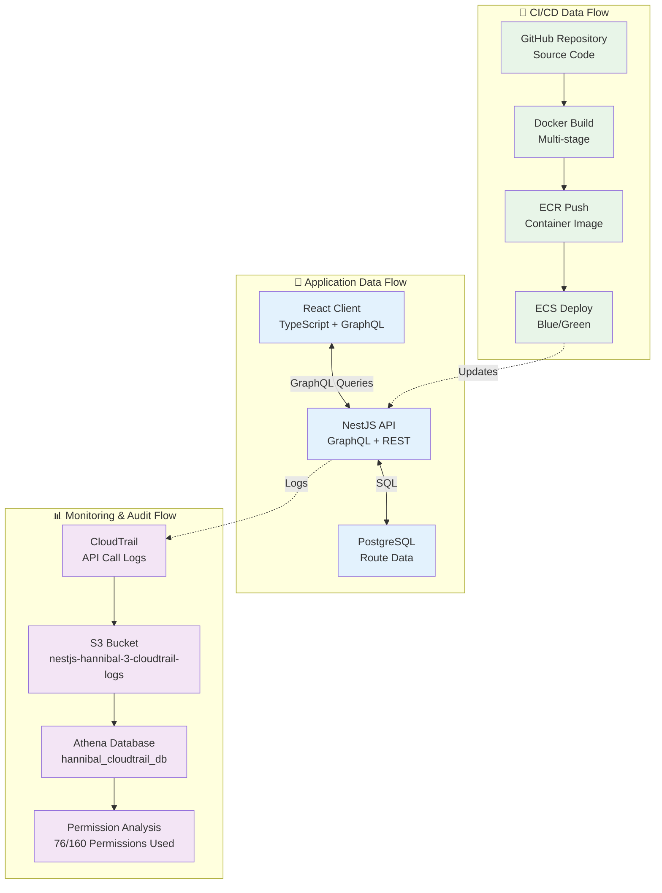

# 監視・権限分析

## 📊 データフロー構成



## 🔍 権限分析（Athena）

CloudTrailログからCI/CD権限の実際の使用状況を分析し、最小権限の原則に基づいた権限最適化を実施します。

### **分析結果**
- **現在のポリシー**: 160ちょいの権限
- **実際に使用**: **76個の権限**（2025年7月27日15-20時JST分析）
- **削減可能**: 約52%の権限削減が可能

### **企業レベル分析手順**
```bash
# 1. パーティション対応テーブル作成（Named Query使用）
aws athena start-query-execution \
  --query-string "CREATE EXTERNAL TABLE IF NOT EXISTS hannibal_cloudtrail_db.cloudtrail_logs_partitioned (Records array<struct<eventName:string,eventSource:string,userIdentity:struct<arn:string,type:string>,eventTime:string,errorCode:string,errorMessage:string,sourceIPAddress:string,userAgent:string>>) PARTITIONED BY (year string, month string, day string) ROW FORMAT SERDE 'org.apache.hive.hcatalog.data.JsonSerDe' STORED AS INPUTFORMAT 'org.apache.hadoop.mapred.TextInputFormat' OUTPUTFORMAT 'org.apache.hadoop.hive.ql.io.HiveIgnoreKeyTextOutputFormat' LOCATION 's3://nestjs-hannibal-3-cloudtrail-logs/AWSLogs/258632448142/CloudTrail/ap-northeast-1/' TBLPROPERTIES ('projection.enabled'='true', 'projection.year.type'='integer', 'projection.year.range'='2025,2030', 'projection.month.type'='integer', 'projection.month.range'='01,12', 'projection.day.type'='integer', 'projection.day.range'='01,31', 'storage.location.template'='s3://nestjs-hannibal-3-cloudtrail-logs/AWSLogs/258632448142/CloudTrail/ap-northeast-1/\${year}/\${month}/\${day}/', 'has_encrypted_data'='false')" \
  --result-configuration OutputLocation=s3://nestjs-hannibal-3-athena-results/ \
  --work-group hannibal-cloudtrail-analysis

# 2. 企業レベル権限統計分析
aws athena start-query-execution \
  --query-string "SELECT COUNT(DISTINCT CONCAT(regexp_replace(record.eventSource, '\.amazonaws\.com$', ''), ':', record.eventName)) as total_permissions, COUNT(*) as total_api_calls, COUNT(DISTINCT record.eventSource) as services_used, MIN(record.eventTime) as analysis_start, MAX(record.eventTime) as analysis_end FROM hannibal_cloudtrail_db.cloudtrail_logs_partitioned CROSS JOIN UNNEST(Records) AS t(record) WHERE record.userIdentity.arn LIKE '%HannibalCICDRole-Dev%' AND record.errorCode IS NULL AND year = '2025' AND month = '07' AND day >= '27'" \
  --result-configuration OutputLocation=s3://nestjs-hannibal-3-athena-results/ \
  --work-group hannibal-cloudtrail-analysis

# 3. 詳細権限分析（時系列対応）
aws athena start-query-execution \
  --query-string "SELECT CONCAT(regexp_replace(record.eventSource, '\.amazonaws\.com$', ''), ':', record.eventName) as permission, COUNT(*) as usage_count, MIN(record.eventTime) as first_used, MAX(record.eventTime) as last_used FROM hannibal_cloudtrail_db.cloudtrail_logs_partitioned CROSS JOIN UNNEST(Records) AS t(record) WHERE record.userIdentity.arn LIKE '%HannibalCICDRole-Dev%' AND record.errorCode IS NULL AND year = '2025' AND month = '07' AND day >= '27' GROUP BY record.eventSource, record.eventName ORDER BY usage_count DESC" \
  --result-configuration OutputLocation=s3://nestjs-hannibal-3-athena-results/ \
  --work-group hannibal-cloudtrail-analysis

# 4. エラー分析（セキュリティ監査）
aws athena start-query-execution \
  --query-string "SELECT record.errorCode, record.errorMessage, CONCAT(regexp_replace(record.eventSource, '\.amazonaws\.com$', ''), ':', record.eventName) as failed_permission, COUNT(*) as error_count FROM hannibal_cloudtrail_db.cloudtrail_logs_partitioned CROSS JOIN UNNEST(Records) AS t(record) WHERE record.userIdentity.arn LIKE '%HannibalCICDRole-Dev%' AND record.errorCode IS NOT NULL AND year = '2025' AND month = '07' AND day >= '27' GROUP BY record.errorCode, record.errorMessage, record.eventSource, record.eventName ORDER BY error_count DESC" \
  --result-configuration OutputLocation=s3://nestjs-hannibal-3-athena-results/ \
  --work-group hannibal-cloudtrail-analysis

# 5. 結果確認
aws athena get-query-results --query-execution-id [QueryExecutionId] --output table
```

### **Professional設計での管理**
**作成済みリソース（Terraform管理）：**
- ✅ `hannibal-cloudtrail-analysis`ワークグループ（暗号化・コスト制御）
- ✅ `hannibal_cloudtrail_db`データベース
- ✅ `create-partitioned-cloudtrail-table`Named Query（パーティション対応テーブル作成）
- ✅ `analyze-hannibal-cicd-permissions`Named Query（権限分析・時系列対応）
- ✅ `count-hannibal-cicd-permissions`Named Query（統計分析・企業レベル）
- ✅ `analyze-hannibal-cicd-errors`Named Query（エラー分析・セキュリティ監査）

**管理方針：**
- **Terraform管理継続**: 設定変更をコード化
- **削除防止**: `prevent_destroy = true`で保護
- **基盤リソース**: `terraform/foundation/athena.tf`で管理

## 🔍 監査・分析システム

### CloudTrail設定
```json
{
  "TrailName": "nestjs-hannibal-3-cloudtrail",
  "S3BucketName": "nestjs-hannibal-3-cloudtrail-logs",
  "IncludeGlobalServiceEvents": true,
  "IsMultiRegionTrail": true,
  "EnableLogFileValidation": true
}
```

### Athena分析クエリ
```sql
-- CI/CD権限使用状況分析
SELECT 
  CONCAT(
    regexp_replace(record.eventSource, '\.amazonaws\.com$', ''), 
    ':', 
    record.eventName
  ) as permission,
  COUNT(*) as usage_count,
  MIN(record.eventTime) as first_used,
  MAX(record.eventTime) as last_used
FROM hannibal_cloudtrail_db.cloudtrail_logs_partitioned 
CROSS JOIN UNNEST(Records) AS t(record)
WHERE record.userIdentity.arn LIKE '%HannibalCICDRole-Dev%'
  AND record.errorCode IS NULL
  AND year = '2025' AND month = '07' AND day >= '27'
GROUP BY record.eventSource, record.eventName
ORDER BY usage_count DESC
```

### 監査ログ保持ポリシー
- **CloudTrail**: 永続保存（コンプライアンス要件）
- **CloudWatch Logs**: 30日間保持
- **Athena結果**: 分析用に1年間保持

## 📊 メトリクス・監視

### アプリケーションメトリクス
- **レスポンス時間**: 平均 < 200ms
- **エラー率**: < 0.1%
- **スループット**: 1000 req/min

### インフラメトリクス
- **CPU使用率**: < 70%
- **メモリ使用率**: < 80%
- **ディスク使用率**: < 85%

## 🚀 CI/CDパイプライン詳細

### GitHub Actions ワークフロー
1. **テスト実行**: Jest + E2Eテスト
2. **Docker Build**: マルチステージビルド
3. **セキュリティスキャン**: 脆弱性チェック
4. **ECRプッシュ**: コンテナイメージ保存
5. **ECS Deploy**: Blue/Green自動デプロイ

### デプロイメント戦略
- **開発環境**: Rolling Update（コスト最適化）
- **本番環境**: Blue/Green Deployment（無停止）
- **ロールバック**: 自動ヘルスチェック失敗時

## 📈 データ処理パフォーマンス

### GraphQL最適化
- **DataLoader**: N+1問題の解決
- **Query Complexity**: 複雑なクエリの制限
- **Caching**: Redis活用（将来実装）

### データベース設計
```sql
-- ルートデータテーブル
CREATE TABLE routes (
  id SERIAL PRIMARY KEY,
  name VARCHAR(255) NOT NULL,
  geojson JSONB NOT NULL,
  created_at TIMESTAMP DEFAULT NOW(),
  updated_at TIMESTAMP DEFAULT NOW()
);

-- インデックス最適化
CREATE INDEX idx_routes_geojson ON routes USING GIN (geojson);
```